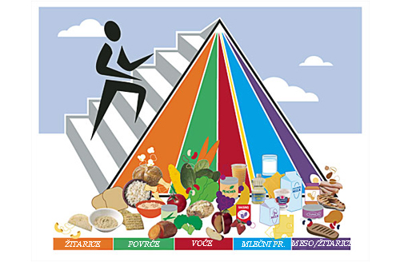

**Kuvanje**

**Nivo veštine: 2**

**1. Čin kuvanja.**

**\_\_\_\_\_\_\_\_\_\_\_\_\_\_\_\_\_\_\_\_\_\_\_\_\_\_\_\_\_\_\_\_\_\_\_\_\_\_\_\_\_\_\_\_\_\_\_\_\_\_\_\_\_\_\_\_\_\_\_\_\_\_\_\_\_\_\_\_\_\_\_\_\_\_\_\_\_\_\_\_\_\_\_\_\_\_\_\_\_\_\_\_\_**

Uputstva za dobijanje ovog čina može se naći u poglavlju Umetnost
domaćinstva
(<http://en.wikibooks.org/wiki/Adventist_Youth_Honors_Answer_Book/Household_Arts>).
Neke od kategorija su: Pečenje, Osnove šivenja, Kuvanje -- početni nivo,
Kuvanje -- napredni nivo, Šivenje haljina -- početni nivo, Šivenje
haljina -- napredni nivo, Konzerviranje namirnica, Sušenje namirnica,
Zamrzavanje namirnica, Održavanje kuće, Veš, Pravljenje otirača, Ishrana
-- početni nivo, Ishrana -- napredni nivo, Krojenje\...

**2. Koliko šolja čini jedan kvart? Koliko mililitara ima jedan litar?
Koliko jedna šolja ima supenih kašika? A koliko jedna supena kašika ima
kafenih kašičica?**

**\_\_\_\_\_\_\_\_\_\_\_\_\_\_\_\_\_\_\_\_\_\_\_\_\_\_\_\_\_\_\_\_\_\_\_\_\_\_\_\_\_\_\_\_\_\_\_\_\_\_\_\_\_\_\_\_\_\_\_\_\_\_\_\_\_\_\_\_\_\_\_\_\_\_\_\_\_\_\_\_\_\_\_\_\_\_\_\_\_\_\_**

-   U jednom kvartu ima 4 šolje.

-   Jedan litar ima 1000 mililitara.

-   Jedna šolja ima 16 supenih kašika.

-   Jedna supena kašika ima 3 kafene kašičice.

**3. Pripremita dva glavna jela -- kaserole koristeći makarone, rezance,
pasulj ili pirinač.**

**\_\_\_\_\_\_\_\_\_\_\_\_\_\_\_\_\_\_\_\_\_\_\_\_\_\_\_\_\_\_\_\_\_\_\_\_\_\_\_\_\_\_\_\_\_\_\_\_\_\_\_\_\_\_\_\_\_\_\_\_\_\_\_\_\_\_\_\_\_\_\_\_\_\_\_\_\_\_\_\_\_\_\_\_\_\_\_\_\_\_\_\_\_**

**Neki od mojih omiljenih recepata.**

+------------------------+---------------------------------------------+
| **Crni/smeđi pasulj i  |                                             |
| pirinač**              |                                             |
+========================+=============================================+
| **Sastojci**           | **Procedura**                               |
+------------------------+---------------------------------------------+
| -   1 pakovanje        | -   Skuvajte pirinač i stavite sa strane.   |
|     pirinča            |                                             |
|                        | -   Otvorite obe konzerve i zagrejte ga.    |
| -   2 konzerve tamnog  |                                             |
|     pasulja            | -   Odmrznite grašak (u mikrotalasnoj 2-3   |
|                        |     minuta).                                |
| -   1 šolja smrznutog  |                                             |
|     graška             | -   Iseckajte jedan mali paradajz.          |
|                        |                                             |
| -   1 mali paradajz    | -   Posložite pirinač i pasulj u kaserolu.  |
|                        |                                             |
| -   Soli po ukusu      | -   Ukrasite graškom i seckanim paradajzom. |
|                        |     Posolite.                               |
+------------------------+---------------------------------------------+

+------------------------+---------------------------------------------+
| **Pečeni ziti (kratko  |                                             |
| sečene makarone)**     |                                             |
+========================+=============================================+
| **Sastojci**           | **Procedura**                               |
+------------------------+---------------------------------------------+
| -   1 pakovanje        | -   Skuvajte makarone prema uputstvu na     |
|     makarona           |     kesi.                                   |
|                        |                                             |
| -   1 konzerva sosa od | -   Prelijte ih sosom i lagano promešajte.  |
|     paradajza          |                                             |
|                        | -   Prebacite ih u vatrostalnu posudu ili   |
| -   Parmezan           |     pleh i pospite parmezanom.              |
|                        |                                             |
|                        | -   Pokrijte folijom i pecite 30 minuta na  |
|                        |     200 stepeni.                            |
|                        |                                             |
|                        | -   Služite toplo.                          |
+------------------------+---------------------------------------------+

+------------------------+---------------------------------------------+
| **Zapečene makarone**  |                                             |
+========================+=============================================+
| **Sastojci**           | **Procedura**                               |
+------------------------+---------------------------------------------+
| -   2 pakovanje        | -   Skuvajte dva pakovanja makarona prema   |
|     makarona           |     uputstvu na kesama. Ocedite ih kada     |
|                        |     budu skoro kuvane (znači, ne u          |
| -   sir                |     potpunosti).                            |
|                        |                                             |
| -   ¼ šolje rendanog   | -   Pomešajte sa sirom.                     |
|     sira               |                                             |
|                        | -   Stavite ih u pleh i odozgo pospite      |
|                        |     rendani sir.                            |
|                        |                                             |
|                        | -   Prekrijte folijom i pecite dva sata na  |
|                        |     180 stepeni. Skinite foliju poslednjih  |
|                        |     15 minuta da gornji sloj dobije         |
|                        |     svetlo-smeđu boju.                      |
|                        |                                             |
|                        | -   Služite toplo.                          |
+------------------------+---------------------------------------------+

+------------------------+---------------------------------------------+
| **Vegetarijanski       |                                             |
| prebranac**            |                                             |
+========================+=============================================+
| **Sastojci**           | **Procedura**                               |
+------------------------+---------------------------------------------+
| -   2 velike konzerve  | -   Izdinstajte crni luk i papriku na vodi. |
|     pasulaj            |                                             |
|                        | -   Pomešajte sa pasuljem.                  |
| -   1 mali crni luk,   |                                             |
|     sitno iseckan      | -   Stavite u posudu sa salamama odozgo.    |
|                        |                                             |
| -   3 supene kašike    | -   Pecite na tihoj vatri 2 sata, pokriveno |
|     zelene paprike (po |     folijom.                                |
|     želji)             |                                             |
|                        |                                             |
| -   4-8                |                                             |
|     vegetarijanskih    |                                             |
|     kolutova salame    |                                             |
+------------------------+---------------------------------------------+

**4. Pripremite dve različite vrste povrćnih obroka.**

**\_\_\_\_\_\_\_\_\_\_\_\_\_\_\_\_\_\_\_\_\_\_\_\_\_\_\_\_\_\_\_\_\_\_\_\_\_\_\_\_\_\_\_\_\_\_\_\_\_\_\_\_\_\_\_\_\_\_\_\_\_\_\_\_\_\_\_\_\_\_\_\_\_\_\_\_\_\_\_\_\_\_\_\_\_\_\_\_\_\_\_\_\_**

Upotrebite sopstvene recepte, neke druge za koje ste čuli ili ove:

+------------------------+---------------------------------------------+
| **Ratatuli             |                                             |
| (provansalski          |                                             |
| specijalitet od        |                                             |
| povrća)**              |                                             |
+========================+=============================================+
| **Sastojci**           | **Procedura**                               |
+------------------------+---------------------------------------------+
| -   Maslinovo ulje     | 1.  Stavite veliku kaserola šerpu na ringlu |
|                        |     i podesite je na srednju temperaturu.   |
| -   1 crni luk         |                                             |
|                        | 2.  Iseckajte crni i beli luk. Kada         |
| -   1 češanj belog     |     kaserola bude vruća, dodajte maslinovo  |
|     luka               |     ulje koliko da prekrije dno.            |
|                        |                                             |
| -   1 patlidžan        | 3.  Dodajte crni i beli luk i dinstajte.    |
|                        |                                             |
| -   1 zelena babura    | 4.  Iseckajte zelenu papriku, tikvice i     |
|     paprika            |     patlidžan. Ubacite u kaserolu.          |
|                        |     Povremeno mešajte.                      |
| -   2 tikvice (mogu i  |                                             |
|     krastavci)         | 5.  Oljuštite paradajz. Iseckajte ih na     |
|                        |     kolutove ili četvrtine i dodajte u      |
| -   6 paradajza        |     kaserolu.                               |
|     srednje veličine,  |                                             |
|     sočni i oljušteni  | 6.  Nakon pet minuta proverite da li je     |
|                        |     paradajz pustio dovoljno vode da        |
| -   Soli i bibera po   |     prekrije povrće -- ako je tako,         |
|     ukusu              |     savršeno. Ako nije, dodajte vode koliko |
|                        |     je potrebno (ne previše).               |
| -   Začini iz Provanse |                                             |
|     po ukusu           | 7.  Dodajte soli, bibera i provansalske     |
|                        |     začine po ukusu. Dovoljna će biti 1     |
|                        |     supena kašika soli, ½ kafene kašičice   |
|                        |     bibera i 1 supena kašika začina.        |
|                        |                                             |
|                        | 8.  Prekrijte kaserolu i neka krčka na      |
|                        |     tihoj vatri 45 minuta do sat vremena.   |
|                        |                                             |
|                        | Broj porcija: 3-4.                          |
+------------------------+---------------------------------------------+

+------------------------+---------------------------------------------+
| **Musaka od zelene     |                                             |
| boranije**             |                                             |
+========================+=============================================+
| **Sastojci**           | **Procedura**                               |
+------------------------+---------------------------------------------+
| -   2 gusto kuvane     | 1.  Zagrejte rernu na 180 stepeni.          |
|     supe od pečuraka   |                                             |
|                        | 2.  Promešajte supe, mleko, soja sos,       |
| -   1 šolja mleka      |     biber, boraniju i 1 1/3 šolje crnog     |
|                        |     luka.                                   |
| -   1 kafena kašičica  |                                             |
|     soja sosa          | 3.  Pecite na 180 stepeni 25 minuta.        |
|                        |                                             |
| -   ¼ kafene kašičice  | 4.  Pospite odozgo preostali crni luk.      |
|     bibera             |                                             |
|                        | Broj porcija: 12.                           |
| -   8 šolja kuvane     |                                             |
|     seckane zelene     |                                             |
|     boranije           |                                             |
|                        |                                             |
| -   Prženi crni luk (2 |                                             |
|     2/3 šolje)         |                                             |
+------------------------+---------------------------------------------+

**5. Pripremite dve vrste salata. Kako ih održati svežim i hrskavim?**

**\_\_\_\_\_\_\_\_\_\_\_\_\_\_\_\_\_\_\_\_\_\_\_\_\_\_\_\_\_\_\_\_\_\_\_\_\_\_\_\_\_\_\_\_\_\_\_\_\_\_\_\_\_\_\_\_\_\_\_\_\_\_\_\_\_\_\_\_\_\_\_\_\_\_\_\_\_\_\_\_\_\_\_\_\_\_\_\_\_\_\_\_\_**

Prvi korak u pripremanju zelene salate jeste pranje. Nažalost, kvašenje
listova će ubrzati njeno propadanje. Uklanjanje vode sa listova će
produžiti njen životni vek u frižideru, a to se može uraditi uz pomoć
centrifugalne cediljke za salatu ili tapkanjem listova kuhinjskim
papirom.

Takođe, korisno je ukloniti sastojke koji upijaju vodu (kao što su
krutoni -- komadići tosta) pre stavljanja u frižider, jer će postati
gnjecavi što se više budu ukvasili.

**Osnovna mešana salata**

-   1 velika činija za salatu

-   Pola glavice zelene salate ili pakovanje mešovite salate

-   1-2 paradajza

-   Male šargarepe (broj po želji -- mogu biti seckane ili rendane)

-   1 teglica crnih maslina, seckanih na krugove (po želji)

-   100 gr tvrdog sira seckanog na kockice ILI rendani parmezan ili
    mocarela sir

Sos za salatu po izboru

**Voćna salata**

Po jedna konzerva:

-   krušaka

-   bresaka

-   ananasa

-   mešanog voća

Ukrasite sušenom brusnicom i/ili orasima po želji.

Sve izmešati i poslužiti ohlađeno. Brusnicom/orasima ukrasiti tik pred
posluženje.

**6. Upoznajte se sa razlikom između punomasnog mleka, mleka sa niskim
sadržajem masti i mlekom koje nije kravlje.**

**\_\_\_\_\_\_\_\_\_\_\_\_\_\_\_\_\_\_\_\_\_\_\_\_\_\_\_\_\_\_\_\_\_\_\_\_\_\_\_\_\_\_\_\_\_\_\_\_\_\_\_\_\_\_\_\_\_\_\_\_\_\_\_\_\_\_\_\_\_\_\_\_\_\_\_\_\_\_\_\_\_\_\_\_\_\_\_\_\_\_\_\_\_**

Punomasno mleko ima 3.5% masnoće. Jedna šolja punomasnog mleka ima oko
160 kalorija i 1/3 zasićenih masti potrebnih u svakodnevnoj ishrani. Za
decu i one kojima je potrebno mnogo kalorija tokom dana (atletičari i
ljudi koji obavljau fizički posao) punomasno mleko je odlična opcija.

Mleko sa niskim sadržajem masti može imati 1,5% i 0,5% masti. Jedna
šolja takvog mleka ima 80 do 120 kalorija. Većina odraslih vodi
sedelački način života i zato bi trebalo da izbegavaju punomasno mleko u
najvećem broju prilika. Umesto toga, trebalo bi da koriste ovo sa 0,5%
masti. Iako je broj kalorija manji za samo 40-60, razlika u sadržaju
masti je značajna. Veliki deo ishrane ljudi u modernom svetu već sadrži
mnoštvo masnoće, daleko više od preporučene svakodnevne doze.

**7. Pripremite uravnoteženi doručak prateći vodič piramide ishrane.**

**\_\_\_\_\_\_\_\_\_\_\_\_\_\_\_\_\_\_\_\_\_\_\_\_\_\_\_\_\_\_\_\_\_\_\_\_\_\_\_\_\_\_\_\_\_\_\_\_\_\_\_\_\_\_\_\_\_\_\_\_\_\_\_\_\_\_\_\_\_\_\_\_\_\_\_\_\_\_\_\_\_\_\_\_\_\_\_\_\_\_\_\_\_**

Vodič piramide ishrane preporučuje da osoba konzumira hranu iz pet
različitih grupa tokom dana. Ne zaboravite da je doručak samo jedan
obrok, stoga nije striktno da sadrži stvari iz svake grupe. Jednostavni
doručak kao što su palačinke sa sosom od jabuka, vegetarijanskim
viršlama i šoljom mleka, odličan je početak dana. Ovo pokriva žitarice,
voćnu, mesnu i mlečnu kategoriju.

Piramidu ishrane je obnovilo i objavilo Odeljenje za poljoprivedu u
SAD-u (**USDA**). Evo verzije iz 2005. godine:

U obnovljenoj, novijoj verziji, USDA je korigovala kriterijum „broja
porcija" i zamenila ga onlajn alatkom koja prikazuje individualni plan i
statistiku. Ova alatka može se naći na
<http://www.mypyramid.org/tracker.php>. Ona omogućava osobi da napravi
dnevnik svakodnevne ishrane, analizira unos kalorija i uporedi ga sa
ishranom koju preporučuje piramida. Još neka poboljšanja u piramidi
ukljčuju zamenu „veličine porcije" sa objektivnijim „šoljama".

Sledeći piramidu ishrane, osoba dobija izbalansiranu i raznovrsnu
ishranu. Da biste se upoznali sa preporukama, idite na
[[MyPyramid.org]{.ul}](http://mypyramid.gov) i ukucajte podatke izviđača
(uzrast, pol i fizička aktivnost). Zatim ćete dobiti iznos količine
hrane iz svake kategorije koju izviđač treba da jede.

Vrednosti u donjoj tabeli odnose se na decu koja su fizički aktivna 60
ili više minuta tokom dana. Za manje aktivnu decu i odrasle, idite na
USDA vebsajt.

**USDA Piramida ishrane**

  -----------------------------------------------------------------------------------
  **Namirnice**     **Žitarice**   **Povrće**   **Voće**   **Mleko**   **Meso &
                                                                       žitarice**
  ----------------- -------------- ------------ ---------- ----------- --------------
  **10-godišnji     **200gr**      **3 šolje**  **2        **3 šolje** **170gr**
  dečak**                                       šolje**                

  **10-godišnja     **170gr**      **2 i po     **2        **3 šolje** **150gr**
  devojčica**                      šolje**      šolje**                

  **11-godišnji     **200gr**      **3 šolje**  **2        **3 šolje** **170gr**
  dečak**                                       šolje**                

  **11-godišnja     **170gr**      **2 i po     **2        **3 šolje** **150gr**
  devojčica**                      šolje**      šolje**                

  **12-godišnji     **230gr**      **3 šolje**  **2        **3 šolje** **180gr**
  dečak**                                       šolje**                

  **12-godišnja     **200gr**      **3 šolje**  **2        **3 šolje** **170gr**
  devojčica**                                   šolje**                

  **13-godišnji     **255gr**      **3 i po     **2        **3 šolje** **180gr**
  dečak**                          šolje**      šolje**                

  **13-godišnja     **200gr**      **3 šolje**  **2        **3 šolje** **170gr**
  devojčica**                                   šolje**                

  **14-godišnji     **280gr**      **3 i po     **2 i po   **3 šolje** **200gr**
  dečak**                          šolje**      šolje**                

  **14-godišnja     **230gr**      **3 šolje**  **2        **3 šolje** **180gr**
  devojčica**                                   šolje**                

  **15-godišnji     **280gr**      **5 šolja**  **2 i po   **3 šolje** **200gr**
  dečak**                                       šolje**                

  **15-godišnja     **230gr**      **3 šolje**  **2        **3 šolje** **180gr**
  devojčica**                                   šolje**                
  -----------------------------------------------------------------------------------

**8. Pripremite vegetarijansko predjelo.**

**\_\_\_\_\_\_\_\_\_\_\_\_\_\_\_\_\_\_\_\_\_\_\_\_\_\_\_\_\_\_\_\_\_\_\_\_\_\_\_\_\_\_\_\_\_\_\_\_\_\_\_\_\_\_\_\_\_\_\_\_\_\_\_\_\_\_\_\_\_\_\_\_\_\_\_\_\_\_\_\_\_\_\_\_\_\_\_\_\_\_\_\_\_**

Evo nekoliko recepata koje možete da isprobate.

+------------------------+---------------------------------------------+
| **Pirinač sa karijem** |                                             |
+========================+=============================================+
| **Sastojci**           | **Procedura**                               |
+------------------------+---------------------------------------------+
| -   1 šolja            | 5.  Uzmite veliku šerpu ili tiganj koji ima |
|     integralnog ili    |     poklopac, uključite ringlu na srednju   |
|     običnog pirinča    |     temperaturu, dodajte puter i sekcani    |
|                        |     crni luk. Dinstajte ga nekoliko minuta  |
| -   2 supene kašike    |     dok ne počne da dobija smeđu boju.      |
|     putera             |                                             |
|                        | 6.  Dodajte kari u prahu i jedan minut      |
| -   1 kafena kašičica  |     mešajte sa crnim lukom.                 |
|     karija u prahu     |                                             |
|                        | 7.  Ubacite kocke za supu, suvo grožđe,     |
| -   ½ iseckanog crnog  |     pirinač i vodu.                         |
|     luka               |                                             |
|                        | 8.  Poklopite i neka krčka dok ne upije svu |
| -   ½ šolje suvog      |     vodu (oko 15 minuta)                    |
|     grožđa             |                                             |
|                        |                                             |
| -   2 šolje vode       |                                             |
|                        |                                             |
| -   2 kocke            |                                             |
|     vegetarijanske     |                                             |
|     supe (oni koji     |                                             |
|     nisu vegetarijanci |                                             |
|     mogu da uzmu kocke |                                             |
|     pileće supe)       |                                             |
+------------------------+---------------------------------------------+

+------------------------+---------------------------------------------+
| **Musaka sa pirinčem i |                                             |
| sočivom**              |                                             |
+========================+=============================================+
| **Sastojci**           | **Procedura**                               |
+------------------------+---------------------------------------------+
| -   ½ šolje            | Skuvajte sočivo (u otprilike 1 ½ šolje      |
|     integralnog        | tečnosti od povrća, sa lovorovim listom).   |
|     pirinča            | Poklopite i neka se krčka oko 45 minuta,    |
|                        | dok sočivo ne omekša, ali ne da se raspada. |
| -   ½ šolje sočiva     | Možda ćete morati da dodate još tečnosti od |
|                        | povrća za vreme kuvanja sočiva; sočivo      |
| -   2 ½ šolje tečnosti | treba da ostane poklopljeno. U isto vreme,  |
|     od kuvanog povrća  | skuvajte integralni pirinač u 1 šolji te    |
|                        | tečnosti -- neka prvo proključa, pa onda    |
| -   1 list lovora      | dodajte pirinač i smanjite ringlu,          |
|                        | poklopite i kuvajte na najnižoj temperaturi |
| -   1 umućeno jaje     | oko 50 minuta.                              |
|                        |                                             |
| -   2 supene kašike    | U jednu činiju stavite tri četvrtine        |
|     začinjene prezle   | kuvanog pirinča i sočivo. Dodajte malo      |
|                        | tečnosti iz sočiva -- možda dve do tri      |
| -   ½ sitno iseckanog  | supene kašike, ne previše. U ovu smesu      |
|     crnog luka         | ubacite jaje, crni luk, maslinovo ulje i    |
|                        | prezlu. Prilagodite razmeru pirinča i       |
| -   1 supena kašika    | sočiva dodajući još pirinča po želji.       |
|     maslinovog ulja    | Prezlu dodajte dok smesa ne postane         |
|                        | kompaktna.                                  |
|                        |                                             |
|                        | Stavite smesu u podmazani pleh i 35 minuta  |
|                        | pecite na 180 stepeni ili dok se oko ivice  |
|                        | ne pojavi korica. Neka se hladi barem 10    |
|                        | minuta pre sečenja i posluživanja.          |
|                        |                                             |
|                        | Broj porcija: 4.                            |
+------------------------+---------------------------------------------+

**9. Isplanirajte jelovnik za celu sedmicu odabirajući makar tri jela
čiji ostaci se mogu nekako upotrebiti.**

**\_\_\_\_\_\_\_\_\_\_\_\_\_\_\_\_\_\_\_\_\_\_\_\_\_\_\_\_\_\_\_\_\_\_\_\_\_\_\_\_\_\_\_\_\_\_\_\_\_\_\_\_\_\_\_\_\_\_\_\_\_\_\_\_\_\_\_\_\_\_\_\_\_\_\_\_\_\_\_\_\_\_\_\_\_\_\_\_\_\_\_\_\_**

Pre nego što počnete, razmislite o tome šta će se dogoditi tokom
sedmice. Izaberite brze i jednostavne recepte onda kada vas vreme bude
pritiskalo, a sačuvajte komplikovanije kad niste u takvoj gužvi. Možda
nećete morati da planirate svaki obrok za svaki dan -- primera radi, ako
niko nije kod kuće od ponedeljka do petka za vreme ručka, nego ćete
umesto toga jesti u školskoj kafeteriji, možete da preskočite planiranje
tih obroka. Ili to može da bude jednostavan sendvič sa puterom od
kikirikija ako porodica pakuje ručak (mada će kesica šargarepa, banana
ili soka biti svakako lep dodatak tome).

Jednostavna jela odlična su kada se radi o ostacima jer se oni mogu
iskoristiti kao sastojci za komplikovanije recepte za kraj sedmice, bez
nagomilavanja dodatnog umora. Na primer, razmislite o receptima koji
traže kuvani pirinač ili zelenu boraniju kao sastojak i pokušajte da to
ubacite u jelovnik za prilog dan-dva pre nego što se ponovo pojavi kao
deo predjela. Ili razmislite o jednostavnim sastojcima koji će vam
ostati i pronađite recept u kom možete da ih upotrebite. Ostaci povrća
idu dobro za supu, a makarone sa sriom mogu biti osnova u mnogo recepata
sa testeninom.

**10. Pripremite uravnoteženi obrok koristeći vegetarijansko predjelo,
musaku s povrćem i salatu.**

**\_\_\_\_\_\_\_\_\_\_\_\_\_\_\_\_\_\_\_\_\_\_\_\_\_\_\_\_\_\_\_\_\_\_\_\_\_\_\_\_\_\_\_\_\_\_\_\_\_\_\_\_\_\_\_\_\_\_\_\_\_\_\_\_\_\_\_\_\_\_\_\_\_\_\_\_\_\_\_\_\_\_\_\_\_\_\_\_\_\_\_\_\_**

U ovom činu postoje recepti za sve tri vrste ovih jela.

**11. Saznajte nekoliko razloga zašto je sirće nezdravo.**

**\_\_\_\_\_\_\_\_\_\_\_\_\_\_\_\_\_\_\_\_\_\_\_\_\_\_\_\_\_\_\_\_\_\_\_\_\_\_\_\_\_\_\_\_\_\_\_\_\_\_\_\_\_\_\_\_\_\_\_\_\_\_\_\_\_\_\_\_\_\_\_\_\_\_\_\_\_\_\_\_\_\_\_\_\_\_\_\_\_\_\_\_\_**

Jako malo se danas piše o nezdravosti sirćeta jer su naučnici otkrili
nekoliko kvaliteta ove nekada pogrešno shvaćene namirnice.

Ipak, daleke 1887. godine, Elen Vajt je napisala:

*„Salate se pripremaju sa uljem i sirćetom, u stomaku nastaje
fermentaciju i hrana se ne vari, već truli i raspada se; kao posledica,
krv ne dobija hranljive sastojke, već se puni nečistoćom, a nastaju
problemi sa jetrom i bubrezima."*

Sirće nije jedino na šta ona upozorava kada se radi o ishrani. Postoji
još nekoliko drugih izjava u kojima spominje da su kiseli krastavčići,
čili, senf, začini i drugi dodaci takođe nezdravi.

*„Ovakvi dodaci štetni su po svojoj prirodi. Senf, biber, začini, kiseli
krastavčići i druge stvari slične njima, iritiraju stomak i unose
nečistotu u krv." (MH 325)*

Ipak, njen generalni princip je izgleda bio

*„U ovom ubrzanom vremenu, što manje uzbudljiva hrana, to bolje." (MH
325)*

Dok se možda pitamo „šta je toliko loše dodati malo \_\_\_\_\_\_\_\_\_\_
u naše jelo", odgovor nije vezan za spasenje, već se tu radi o zdravom
izboru: da li mi je to POTREBNO da bih svario i uživao u hrani? U mnogim
slučajevima uviđamo da je odgovor: „U stvari, i nije."

Zapravo, ako generalno pojednostavimo svoju ishranu, možda ćemo postati
zdraviji i srećniji nego ranije!

**12. Šta kafein radi telu? Nabrojte pet stvari koje sadrže kofein.**

**\_\_\_\_\_\_\_\_\_\_\_\_\_\_\_\_\_\_\_\_\_\_\_\_\_\_\_\_\_\_\_\_\_\_\_\_\_\_\_\_\_\_\_\_\_\_\_\_\_\_\_\_\_\_\_\_\_\_\_\_\_\_\_\_\_\_\_\_\_\_\_\_\_\_\_\_\_\_\_\_\_\_\_\_\_\_\_\_\_\_\_\_\_**

Kafein je blagi stimulans za centralni nervni sistem. Ne stvara
zavisnost, ali može da stvori naviku. Kada se unos kafeina iznenada
prekine, neke osobe mogu imati glavobolje, osećati umor ili mamurluk. Na
efekat kofeina utiču godine i telesna veličina. Dete ili sitnija osoba
može osetiti jači efekat kofeina nego odrasla ili teža, viša osoba.

Evo spiska nekih od namirnica koje sadrže kofein:

1.  Kafa s kofeinom

2.  Neka bezalkoholna pića

3.  Neka piva.

4.  Neki čajevi

5.  Čokolada

6.  Kakao

## 

## 13. Sakupite 25 recepata za jela koja ste lično napravili, s tim da ne bude više od pet za poslastice.

**\_\_\_\_\_\_\_\_\_\_\_\_\_\_\_\_\_\_\_\_\_\_\_\_\_\_\_\_\_\_\_\_\_\_\_\_\_\_\_\_\_\_\_\_\_\_\_\_\_\_\_\_\_\_\_\_\_\_\_\_\_\_\_\_\_\_\_\_\_\_\_\_\_\_\_\_\_\_\_\_\_\_\_\_\_\_\_\_\_\_\_\_\_**

Evo prilike da budete kreativni! Pogledajte knjige s receptima u vašoj
kuhinji, kod bake i deke, možda čak i u biblioteci.

Koja vam je omiljena hrana sa zajedničkim ručkovima? Možda biste mogli
da pitate ljude koji su je spremili da vam daju recept!

Crkvena knjižara ima nekoliko knjiga sa receptima u kojima možete
pronaći načine za pripremanje zdravih, a ukusnih jela.

Smestite svojih 25 recepata u kutiju ili knjigu.

**Evo nekih kategorija**:

-   Predjela

-   Doručak

-   Poslastice

-   Povrće

-   Prilozi

-   Salate

-   Supe

Pažnja: Jedno od najuspešnijih „nepisanih pravila" za prikupljanje
istinski uspešnih recepata za VAS je: da li moj frižider i špajz OBIČNO
imaju većinu sastojaka za taj recept? Na taj način možete napraviti to
jelo kada god poželite, a da ne trčite prethodno u prodavnicu, i to u
poslednji čas!
