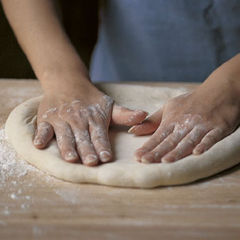
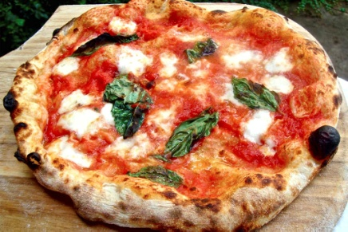
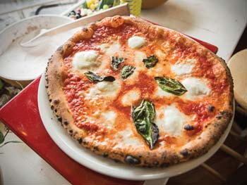
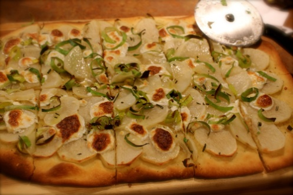
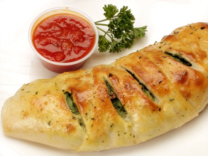
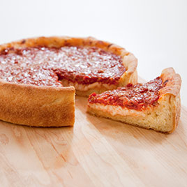
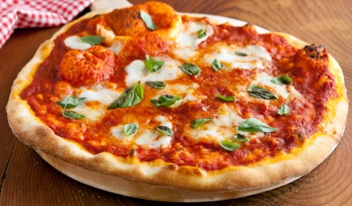

1.  **Napravi malo istraživanje istorije pica.**

Mala pretraga na internetu će pružiti veliku količinu informacija o
nastanku.



2.  **Napravi listu osnovnih sastojaka testa za picu.**

(Za tri pice)

500g brašna (mešavina brašna za picu ili pola mekog i pola oštrog belog
brašna)

325ml vode

10g soli

10g svežeg kvasca

Malo ulja

3.  **Nađi barem jedan biblijski tekst o svakom od sastojaka. Objasni
    barem 4 od tih tekstova i njihovo simboličko značenje.**

  -------------------------------------------------------------------------
  **Brašno**    **Voda**      **So**         **Kvasac**      **Ulje**
  ------------- ------------- -------------- --------------- --------------
  2\. Mojsijeva 2\. Mojsijeva 2\. Mojsijeva  2\. Mojsijeva   2\. Mojsijeva
  29:2          23:25         19:23-26       12:39           27:20

  3\. Mojsijeva Isaija 55:1   3\. Mojsijeva  Matej 13:33     3\. Mojsijeva
  2:7                         2:13                           8:10-11

  Sudije 6:19   Matej 10:42   Jov 6:6        Matej 16:5-12   4\. Mojsijeva
                                                             11:8

  1\. Carevima  Jovan 4.13-14 Matej 5:13     1\. Korinćanima Matej 25:1-13
  17:16                                      5:6-8           
  -------------------------------------------------------------------------

4.  **Opiši proces vrenja**

Kao i kod drugih kiselih testa i testo za picu ima mnogo dobrobiti od
procesa vrenja. Kvasac koji se stavi u mlaku vodu i brašno počinje
proces vrenja. Kvasac sačinjavaju gljivice koje se hrane šećerima a
najviše proizvode ugljen dioksid. Pošto pšenično brašno sadrži u sebi
složene šećere i zbog velike količine vlage u testu, kvasac će ubrzo
početi da se umnožava i stvara ugljen dioksid čime će činiti da se testo
povećava i ima balončiće vazduha. Proces vrenja se završava time što se
pica ispeče.

Zavisno od temperature na kojoj se odvija vrenje, dobijaju se i
različiti ukusi i boja ispečene kore. Ukoliko je testo mekše, zbog
veliko količine vode (preko 50% sprem težine brašna) ili ukoliko je bilo
skladišteno u hladnom okruženju (frižider), kvasac i bakterije prisutne
u testu će težiti da proizvedu veće količine mlečne kiseline koja će
stvoriti ukus završene kore sličnije kiselim testima. Za razliku od toga
ukoliko ima manje vode u testu i ukoliko je fermentisano na višljoj
temperaturi, završena kora će imati ukus sličniji belom hlebu iz radnje.

5.  **Koja je razlika između napuljskog i rimskog stila pice.**

  -------------------------------------------------------------------------------------------------------------------------------------------------------------------
                    **Napuljski stil**                                                       **Rimski stil**
  ----------------- ------------------------------------------------------------------------ ------------------------------------------------------------------------
  Mesto nastanka    Napulj, Italija                                                          Rim, Italija

  Oblik             Okrugla (ne obavezno pravilnog oblika)                                   Okrugla, pravougaona ili isečci za poneti

  Prečnik           \< 35 cm                                                                 Veća od napuljske

  Debljina kore     \< 1/3 cm u sredini                                                      Tanja od napuljske

  Karakteristika    Sa kvascem, deblji krajevi                                               Bez kvasca, tvrđe testo
  testa                                                                                      

  Razvijanje        Samo ručno                                                               Sa oklagijom

  Vreme pečenja     \~90 sekundi na temperaturi \> 450°C                                     \~10 minuta na temperaturi 220°C

  Način jedenja     Sedeći sa nožem i viljuškom                                              Sedeći ili usput iz ruku

  Izgled                                                       height="1.3333333333333333in"}
  -------------------------------------------------------------------------------------------------------------------------------------------------------------------

6.  **Sudeći po obliku i veličini, koliko poznaješ vrsti pice.**

  --------------------------------------------------------------------------------------------------------------------------------------------------------------
  Napuljske pice su poznate po standardnom 
  da krug bude sasvim pravilan.            
  ---------------------------------------- ---------------------------------------------------------------------------------------------------------------------
  Rimske pice mogu biti okrugle (pravilan  
  krug) a mogu biti i pravougaonog oblika. 
  Uglavnom se seku na parčadi za poneti    
  trougaonog ili pravougaonog oblika.      

  Calcone (na italijanskom doslovno znači  
  „čarapa") je testo za picu koje je       
  presavijeno na pola a ispunjeno          
  uobičajenim prelivom za picu, nakon čega 
  je ispečeno.                             

  Pica na sprat, Čikaška (Deepdish pizza   
  po debeloj kori i velikoj količini sira. 

  Kokas, Španska pica je pravougaonog      
  oblika i seče se u trouglove. Uglavnom   
  je ljuta pica a liči i na italijanske    
  pice.                                    

  \... istražite koji još oblici pica      
  postoje                                  
  --------------------------------------------------------------------------------------------------------------------------------------------------------------

7.  **Koja su tri različita načina da se peče pica. Detaljno opiši
    razlike.**

```{=html}
<!-- -->
```
1.  U peći na drva. U tradicionalnim picerijama često se mogu naći peći
    koje su zidane posebno za ovu namenu. U njima se loži vatra sa
    drvima a kada se dobije radna temperatura užareno ugljevlje i drvo
    koje još gori se razgrne sa strane a na sredinu se postavi pica koja
    se peče. Za vreme pečenja se pica okreće kako bi se ravnomerno
    ispekla. Peći na drva mogu da budu izgrađene od posebnih cigli
    otpornih na veliku toplotu, ali mogu da budu napravljene i od
    mešavine gline, peska i slame, pa čak i jednostavnim kopanjem rupe u
    zemljanom zidu. Zbog velike temperature koju ove peći mogu da
    postignu, pice napravljene u njima imaju poseban ukus.

2.  U električnoj rerni. U ostalim picerijama ili pekarama često se
    nalaze različite varijante električnih rerni za pravljenje pice, kao
    i u većini domaćinstava što se nalazi običan električni šporet sa
    rernom. Kod električne rerne temperatura može da se preciznije
    podesi, ali je mana što ne može da dostigne toliku temperaturu kao
    kod peći na drva, a takođe ne može da postigne da se pica ravnomerno
    peče sa svih strana (što je očiglednije kod kućnih šporeta). Kako bi
    se ublažila ova mana, može da se koristi kamen za pečenje pice koji
    se stavi u rernu da se dobro zagreje kako bi prilikom pečenja pice
    direktno preneo što više toplote u nju i od dole. Pica se u kućnom
    šporetu peće na najvišoj temperaturi (bitno je da je dovoljno
    zagrejana pre stavljanja pice) od 8 do 20 minuta, zavisno od jačine
    šporeta i vrste pice.

3.  Na roštilju. Pica na roštilju nudi visoku temperaturu peći na drva
    što je čini pristupačnim većem broju ljudi koji nemaju peć na drva.
    Roštilj treba da se zagreje što više (barem 300°C). Sve sastojke,
    prelive i što planirate da stavite na picu je bitno da stavite blizu
    roštilja. Pripremite testo za picu. Namažite jednu stranu kore za
    picu sa maslinovim uljem i sa te strane postavite je direktno na
    roštilj. Premažite i gornju stranu sa maslinovim uljem. Pecite picu
    2-3 minute bez poklopca ili 1-2 minute sa poklopcem povremeno
    proveravajući kako napreduje pica (ne treba da bude skroz stvrda
    kora). Okrenite picu i na brzinu nafilujte picu. Ne mojte preterati
    sa količinom stvari koje stavljate od gore jer se inače neće dobro
    ispeći. Poklopite roštilj i pecite još 3 do 5 minuta. Ako počne da
    dimi, pomerite picu na hladniji deo roštilja kako ne bi zagorela.
    Izvadite picu i poslužite je.

```{=html}
<!-- -->
```
8.  **Koja je idealna temperatura ako koristiš peć na drva da bi ispekao
    picu? Koja je idealna temperatura ako koristiš električni šporet?**

Zavisno od vrste pice zavisi i idealna temperatura. Ipak, u
tradicionalnoj peći na drva najčešće se pripremaju napuljske pice koje
zahtevaju temperaturu 420-450°C. Idealna temperatura za električni
šporet je 220°C, ali ukoliko je moguće i više, treba isprobati.

9.  **Pripremi Picu Margaritu ili Marinaru po tradicionalnom receptu.**

Pošto su obe pice napuljske, one imaju istu pripremu kore.

Sastojci su isti koji su opisani u 2. zadatku (500g brašna, 325ml vode,
10g soli, 10g kvasca). Kvasac se rastvori u mlakoj vodi nakon čega se
brašno i so polako dodaju uz mešanje. Testo se izmesi nakon čega se
pokrije kesom ili streč folijom kako se ne bi dobila tvrda korica, i
ostavi se sat i po -- dva da raste ili dok se ne duplira u veličini.
Testo se zatim pritisne da izađe vazduh iz balončića i uvalja u veliku
loptu iz koje se iseku tri loptice po 275g. Svaka loptica se uštine i sa
tim testom između prstiju se obavije oko same sebe dok nije skroz
obavita. Nakon toga se dva kraja pritisnu na unutra i ostavi da se
odmara testo na jednom od tih krajeva. Loptice se pospu sa brašnom i
pokriju vlažnim peškirom. Površina loptica bi trebala da bude mekana i
glatka. Tako trebaju da se odmaraju sat vremena. Ako ih nećete koristiti
u roku od sat vremena, stavite ih u frižider.

Nakon toga, svaka napuljska pica se tradicionalno razvija samo rukama po
površini na kojoj ima dovoljno brašna kako se ne bi lepila. Kora ne
treba da bude debela (u sredini do 3,5mm) a krajevi malo deblji. Prečnik
kore ne treba da bude veći od 35cm.

*Pica Margarita*

Sastojci:

1-2 zrela sveža paradajza

100g mocarela sira

3-4 sveža lista bosiljka

malo maslinovog ulja

Priprema:

Paradajz se stavi u ključalu vodu 10 sekundi, nakon čega se stavi u
hladnu vodu. Peteljka se iseče a ljuska oljušti. Takav paradajz se
naseče na kolutove i poređa na koru. Mocarela sir se naseče na komade i
poređa po kori i malo se prelije sa maslinovim uljem. Na kraju se stavi
nekoliko listova svežeg bosiljka.

*Pica Marinara*

Sastojci:

2 češnja belog luka

2 zrela sveža paradajza

30ml maslinovog ulja

3-4 sveža lista bosiljka

so

Priprema:

Paradajz se stavi u ključalu vodu 10 sekundi, nakon čega se stavi u
hladnu vodu. Peteljka se iseče a ljuska oljušti a semenje istisne. Fino
se nasecka paradajz, stavi u đevđir, posoli i ostavi da se cedi 20
minuta. Prebaci se u drugu posudu, umeša sa maslinovim uljem (i ako je
potrebno saftom od paradajza). Ova mešavina se ravnomerno premaže preko
pice, a fino naseckani beli luk i bosiljak se poređaju preko toga.
