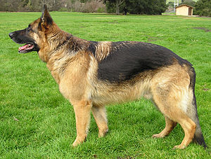
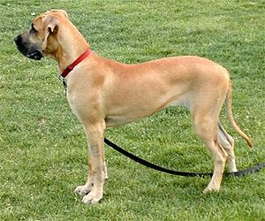
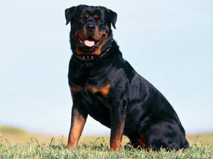

**1. Koje je naučno ime porodice pasa?**

Psi (lat. Canidae) se dele u dve grupe (porodice):

a)  Canini (srodni vukovima)

b)  Vulpini (srodni lisicama).

2\. Nabroj pet karakteristika porodice pasa.

-   imaju 42 zuba

-   hodaju na šapama

-   imaju 4 kandže na zadnjim nogama a 5 na prednjim

-   imaju dva sloja dlake - spoljašnji sloj grube dlake i unutrašnji
    sloj sa finom dlakom (poddlaka).

-   Imaju odlično čulo mirisa

-   Psi imaju odlicno čulo sluha zahvaljujući epidermalnim izraslinama
    na ušima. One takođe služe da zaštite uši od hladnoće inečistoće.

-   mogu da raspoznaju boje ali ne u spektru koji mogu ljudi

3\. Indetifikuj sa slike 5 divljih članova porodice pasa

  -------------------------------------------------------------------------------------------------------------
  siva lisica                        
  ---------------------------------- --------------------------------------------------------------------------
  arktička lisica                    

  pustinjska lisica                  

  srebrna lisica                     

  crvena lisica                      

  Sivi vuk                           

  Kojot                              

  Dingo                              

  Zlatni šakal                       

  Prugasti šakal                     

  Crnoleđi šakal                     
  -------------------------------------------------------------------------------------------------------------

4\. Identifikuj sa slike 20 rasa pasa

  -----------------------------------------------------------------------------------------------------------------------------------------------------------
  Avganistanski hrt                  
  ---------------------------------- ------------------------------------------------------------------------------------------------------------------------
  Nemački ovčar                      

  Zlatni retriver                    

  Sibirski haski                     

  Bigl                               

  Border Kolli (graničarski ovčar)   

  Škotski ovčar                      

  Pit bul terijer                    

  Bokser                             

  Buldog                             

  Dalmatinac                         

  Persijski Hrt                      

  Bernardinac                        

  Danska Doga                        

  Rotvajler                          

  Doberman                           

  Australijski ovčarski pas          

  Mađarska vižla                     

  Oštrodlaki jazavičar               

  Pekinezer                          

  Lovački Pas                        

  Labrador retriver                  

  Šarplaninac                        

  Koker španijel                     

  Irski seter                        

  Džek Rasel terijer                 

  Napuljski mastif                   

  Njufaundler pas                    

  Šar pej                            

  Bloodhound                         
  -----------------------------------------------------------------------------------------------------------------------------------------------------------

5\. U čemu psi mogu da pomognu?

-   Kućni ljubimci

-   Psi vodiči pomažu slepima da budu samostalni.

-   Psi čuvari čuvaju imanje (i njihove vlasnike).

-   Lovački psi donose plen

-   Ponekad pomažu pri transportu (uprežu se u sanke).

-   Ovčari pomažu pri čuvanju stada, krda, živine.

-   Mogu da budu korišćeni za praćenje, bilo da pomažu u hvatanju
    > kriminalca ili da nađu nestalu osobu.

-   Mogu da otkriju eksplozive.

-   Mogu da pomognu pri traženju žrtava u ruševina posle zemljotresa ili
    > pod snegom nakom lavina.

6\. Koja je najmanja a koja najveća rasa pasa?

Najmanji pas je Čivava. Za mnoge vrste pasa može da se tvrdi da su
najveći, u zavisnosti šta se pod najvećim podrazumeva. Najviši je Irski
vučiji pas, dok su Mastif, Doga i Bernardinac teži. Bernardinac je
najteži među njima.

7\. Napiši ili usmeno kaži koje koristi ima čovek od sledećih vrsta
pasa.

> a\. Psi vodiči
>
> Psi vodiči su pomoćni psi trenirani da vode slepe ili ljude sa
> oštećenim vidom izbegavajući prepreke. Osoba koji ima ovakvog psa daje
> naredbe koje su psi naučili kroz predhodnu obuku. Možemo ih uporediti
> sa posadom aviona. Slepa ili slabovida osoba je slična navigaciji
> aviona, mora da zna kako da dođe od jednog mesta do drugog, dok je pas
> kao pilot koji treba do tamo da ih odvede bezbedno.
>
> b\. Bernardinci (spasilački psi)
>
> Preci bernardinca su stočarski psi Švajcarskih poljoprivrednika.
> Njihovo poreklo potiče sa Alpskog prelaza St. Bernard. Najpoznatiji
> pas je Beri koji je u prolazu St.Bernard spaio od lavina između 40 i
> 100 života. Podignut je spomenik slavnom Beriju, dok se telo čuva u
> prirodnjačkom muzeju u Bernu u Švajcarskoj.
>
> Klasični bernardinac je izgledao mnogo drugačije od današnjeg
> bernardinca, zbog lavine koja je u ono vreme pobila mnogo pasa. Zbog
> toga su odgajivači preostale pse ukrštali sa drugim rasama ali u tom
> procesu izgubili su mnogo od njihove upotrebe kao spasilačkih pasa.
>
> c\. Ovčarski pas
>
> Ovčar je vrsta domaćeg psa čija je prvobitna namena bila da čuvaju
> ovce (stada) ili druge vrste stoke. Ovčar direktno pomaže pastiru oko
> stada, tako što mu pomaže oko vođenja stada od obora do pašnjaka gde
> čuva stado na okupu i čuva ih od predatora.
>
> d\. Škotski ovčari
>
> Škotski ovčari su vrsta ovčarskog psa. Spadaju u grupu
> najinteligentnijih pasa.
>
> e\. Eskimski pas
>
> Tipičan pas za vuču sanki u artičkom podneblju. Čopor od 20 eskimskih
> pasa može bez odmora vući dve tone materijala i do 40 km udaljenosti.
> Eskimski pas ne laje već zavija poput vuka.

8\. Napiši ili usmeno kaži koje koristi ima čovek od psa u ratu

Od davnina se psi koriste u ratu od strane vojske. Korišćeni su za:

-   da nanjuše mine

-   da odnesu poruku (kao kuriri)

-   kao stražari

-   kao skauti (izviđači)

-   da direktno napadaju neprijatelje u borbi

9\. Identifikuj sa slike 3 vrste pasa koji su okarakterisani kao psi za
pratnju i razonodu

  --------------------------------------------------------------------------------------------------------------
  Patuljasti špic                    
  ---------------------------------- ---------------------------------------------------------------------------
  Čivava                             

  Pudla                              

  Maltezer                           

  Jorkširski terijer                 
  --------------------------------------------------------------------------------------------------------------

10\. Koja je jedina rasa pasa koja ima potpuno plavi ili crni jezik?

Čau-čau

11\. Koji je najbrži trkački pas?

Najbrži pas je Engleski kratkodlaki hrt, koji može dostići brzinu preko
70km/h.

12\. Nabroj koje su najpopularnije rase pasa iz filmova i crtanih
filmova

\- Filmovi:

-   Zlatni retriver kao Badi

-   Bernadinac kao Betoven

-   Škotski ovčar kao Lesi

-   Dalmatinac kao 101 dalmatinac

\- Crtani filmovi

-   Bigl kao Snupi

-   Doga kao Skubi Du

13\. Koja je vrsta psa posebno korisna u hvatanju kriminalaca?

Bloodhound ima izrazito čulo mirisa. Te se zbog toga koristi u traganju
za kriminalcima, izgubljenim dementnim osobama i decom.

14\. Ispričaj ili napiši jedno tvoje iskustvo sa psom.
