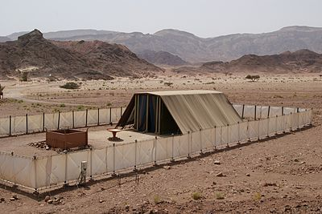

1.  **Navedi tri dela svetinje i dvorišta**

Tri glavna dela svetinje su bili: dvorište, svetinja i svetinja nad
svetinjama.

a.  **Objasni kakav je bio svaki deo**

> \- Dvorište: altar za žrtve, umivaonik
>
> - Svetinja: sto sa beskvasnim hlebovima,
> sedmokraki svećnjak i kadioni oltar
>
> \- Svetinja nad svetinjama: kovčeg zaveta, heruvimi, presto milosti,
> Mojsijev zakonik (4. Mojsijeva 31:26), izveštaj o događaju iz Sihema
> (Stvaranje, patrijarsi i proroci, str. 524. originala)

b.  **Objasni šta je svaki deo nameštaja predstavljao**

> \- Žrtveni oltar: Isusova žrtva
>
> \- Umivaonik: Čišćenje od greha, jedan vid krštenja
>
> \- Sto sa beskvasnim hlebovima: Isus, Hleb života
>
> \- Sedmokraki svećnjak: Isus, Svetlo sveta (Ulje = Sveti Duh)
>
> \- Kadioni oltar: Molitve koje se uzdižu ka nebu, posredovanje i
> Hristove zasluge
>
> \- Kovčeg zaveta: Božja prisutnost (10 zapovesti)
>
> \- Presto milosti: Mesto sastanka
>
> \- Heruvimi: Božje osobine

2.  **Nacrtaj skicu svetinje u pravim razmerama, dvorište i pozicije
    svog nameštaja. (Ne zaboravi da dodaš i oznake za strane sveta).**

Na skici ispod sever je na gore.

3.  **Koliko pokrivala se nalazilo nad svetinjom?**

Svetinja je bila prekrivena sa četiri sloja opisanim ispod

a.  **Navedi svako od pokrivala u redu od unutra ka napolje.**

> 2\. Mojsijeva 26
>
> 1\. Unutrašnji carski sloj: Prekriv je bio načinjen od crvenih, plavih
> i ljubičastih platna.
>
> 2\. Kozja dlaka: Izbeljena.
>
> 3\. Ovnujska koža: Ofarbana u crveno.
>
> 4\. Jazavičja koža: Obična i braon. Interesantan je podatak da je ovaj
> deo stiha preveden sa „jazavičja koža" u prevodu Starog Zaveta od Đure
> Daničića. Pošto je Staro hebrejski izraz nejasan, on ima i mnoge druge
> prevode, uključujući „Izdržljiva koža" (NIV), „Fina koža" (CEV), „Koža
> od foke" (ASV) ili „kozja koža" (ESV).

b.  **Navedi šta je svako pokrivalo predstavljalo.**

> 1\. Unutrašnji carski sloj predstavljao je Isusa. Crveno je
> predstavljalo Hristovu žrtvu. Plavo je predstavljalo Njegovu odanost.
> Ljubičasto je predstavljalo Njegovo carsko dostojanstvo a zlatno je
> predstavljalo pojam da je On nebeski.
>
> 2\. Pletena kozja koža je predstavljala Isusovu savršenost i čistotu.
>
> 3\. Ovnujska koža ofarbana u crveno je predstavljala krv Isusovu.
>
> Jazavičja koža je predstavljala Isusovo božanstvo sa čovečnošću.

4.  **Sledeće boje su bile korišćene u svetinji i na svešteničkoj odeći.
    Objasni šta je svaka boja predstavljala:**

    a.  **Crvena** -- Hristova krv (Jevrejima 9:11,12)

    b.  **Plava** -- Poslušnost (3. Mojsijeva 15:38,39)

    c.  **Ljubičasta** -- Carsko dostojanstvo (Marko 15:16-18)

    d.  **Bela** -- Pravednost, Čistota (Otkrivenje 19:8)

    e.  **Crna** -- Greh (1. Jovanova 1:5)

    f.  **Zlatna** -- Božanstvo na nebu (Jov 22:25)

    g.  **Srebrna** -- Čežnja (Jevrejska reč čeznuti (kāsap) deli koren
        reči sa jevrejskom reči za *srebro* (kesap)

    h.  **Mesingana** -- Božanstvo na Zemlji (Filibljanima 2:5-8 --
        Potpuno Bog i potpuno Čovek -- stopljeno)

5.  **Nauči napamet i objasni stihove: 1. Jovanova 1:9, Danilo 8:14 i 2.
    Mojsijeva 25:8.**

> **1. Jovanova 1:9**: „Ako priznajemo grehe svoje, veran je i pravedan
> da nam oprosti grehe naše, i očisti nas od svake nepravde."
>
> **Danilo 8:14**: „I reče mi: Do dve hiljade i tri stotine dana i noći;
> onda će se svetinja očistiti."
>
> **2**. **Mojsijeva 25:8**: „I neka mi načine svetinju, da među njima
> nastavam;"

6.  **Sveštenicu su bili iz kojih od 12 plemena? Zašto?**

Oni su bili iz Levijevog plemena. Odbili su da se poklone i obožavaju
zlatno tele. Bilo bi interesantno i spomenuti ovde da je u stvari bilo
13 Izrailjskih plemena. Možeš naći mnoge različite liste u Svetom Pismu
koje prikazuju različite statističke brojeve kao što je koliko je bilo
vojnika u svakom od plemena. U vreme izgradnje šatora od sastanka
Josifovo pleme je bilo podeljeno na dva prlemena, na Jefrema i Manasiju.
Leviti nisu obezbeđivali vojnike za vojsku niti imali deo Izrailjske
zemlje, oni su imali odgovornosti za različite gradove rasute po
Izrailju. Kada su Izrailjci prebivali oko šatora od sastanka pažljiva
uputstva su bila data gde će svako od 12 plemena postavljati svoje
šatore; koja tri na sever, koja tri na jug, istok i zapad. Levitima su
šatori bili postavljeni blizu i okolo šatora od sastanka. Leviti su bili
sačinjeni od četiri glavne porodične grupe od kojih je svaka nosila
različite odgovornosti: Vođenje brige o šipkama, zlatnim predmetima,
odećom, itd. Jedna porodica su bili Čuvari i nalazili su se na ulazu kod
kapije. Takođe je interesantno primetiti da je Isus imao 12 učenika.
Isus je predstavljao Prvosveštenika i zajedno sa 12 drugih je činilo
grupu od 13-oro.

2\. Mojsijeva 32:25-29: „A Mojsije videći narod go, jer ga ogoli Aron na
sramotu pred protivnicima njegovim, Stade Mojsije na vrata od logora, i
reče: K meni ko je Gospodnji. I skupiše se pred njega svi sinovi
Levijevi.

I reče im: Ovako kaže Gospod Bog Izrailjev: Pripašite svaki svoj mač uz
bedro svoje, pa prođite tamo i amo po logoru od vrata do vrata, i
pobijte svaki brata svog i prijatelja svog i bližnjeg svog. I učiniše
sinovi Levijevi po zapovesti Mojsijevoj, i pogibe naroda u onaj dan do
tri hiljade ljudi. Jer Mojsije reče: Posvetite danas ruke svoje Gospodu,
svak na sinu svom i na bratu svom, da bi vam dao danas blagoslov."

7.  **Opiši uloge:**

    a.  **Običnog sveštenika**

> Sveštenici su nosili lanene pantalone ispod haljine. Odeće su bile
> ispletene iz jednog dela, bez mrlje ili kojeg nedostatka nedostatka.
> Svi obični sveštenici su nosili obične, bele lanene haljive i turban.
> Oni su uvek izuvali svoje sandale pre nego što bi ulazili u Svetinju.
> (2. Mojsijeva 28 i 39)

b.  **Prvosveštenika**

> Kao i svi sveštenici i prvosveštenik je nosio lanene pantalone ispod
> haljine. Odeća je bila ispletena iz jednog dela, bez mrlje ili kojeg
> nedostatka. Preko pantalona je nosio izvezeni lanenu haljinu, takođe
> ispletenu iz jednog dela tkanine. Haljina je bila povezana sa
> izvezenim pojasom. Preko toga, prvosveštenik je nosio haljinu bez
> rukava iz jednog dela u čisto plavoj boji. Na rubu plave haljine
> visila su zlatna zvonca i narovi.
>
> Oplećak je bio nošen preko plave haljine -- kraća odeća od zlata i od
> plavog, ljubičastog, grimiznog i fino pletenog platna. Oplećak je bio
> pričvršćen na ramena sa dva kamena oniksa a na svakoj strani su bila
> upisana imena Izrailjskih plemena. Na oplećku prvosveštenik je nosio
> pojas koji je bio napravljen od dva komada tkanine zajedno
> pričvršćenim. Na oplećku, do prvosveštenikovog srca bila su dva kamena
> od oniksa zvani Urim i Tumim, preko kojih je Bog obznanjivao svoju
> volju.
>
> Na spoljašnjem delu oplćka je bilo 12 dragocenog kamenja. Oni su bili
> poređani u četiri reda i tri kolone. Njihov rasopred je bio s leva na
> desno, od gore na dole: Sardoniks (braonkasto crven), topaz (žut do
> žućkasto crven), smaragd (čisto zelen), karbunkul (crven), safir
> (modro plav), dijamant (svetlucavo providan), hijacint (svetlo žut),
> ahat (blago plav), ametist (ljubičast), hrisolit (zeleno-žit), onih
> (svetlo žut) i jaspis (crven, braon ili žut).
>
> On je nosio turban (krunu) na svojoj glavi. Plavim vrpcama pričvršćena
> za čeoni deo turbana stojala je pločica od čistog zlata na kojem je
> bio ugraviran natpis „Svetinja Gospodu" (2. Mojsijeva 28 i 39).

8.  **Pročitaj i objasni 488. stranicu (originala) iz knjige „Velika
    Borba" i Jevrejima 4:14-16.**

**Velika Borba:**

„Predmet Svetinje i istražnog suda Božјi narod treba јasniјe da razume.
Svako za sebe treba da stekne lično poznanje o položaјu i delu našeg
velikog Poglavara svešteničkog, inače će im biti nemoguće da u ovom
vremenu imaјu pravu veru, ili da zauzmu položaј koјi im јe Bog namenio.
Mi treba da svedočimo o velikim istinama koјe nam јe Bog poverio.
Nebeska svetinja јe samo središte Hristovog rada u korist čoveka i
odnosi se na svaku dušu koјa živi na ovoј zemlji. Ona nam otvara pogled
na plan spasenja, dovodeći nas do samog završetka vremena i otkriva nam
triјumfalan svršetak borbe između pravde i greha. Od naјveće јe važnosti
da svi koјi su primili svetlost, i stari i mladi, temeljito prouče ove
predmete i budu spremni da daјu odgovor svakome ko ih pita za razlog
njihove vere."

**Jevrejima 4:14-16:**

„Imajući, dakle, velikog Poglavara svešteničkog, koji je prošao nebesa,
Isusa sina Božijeg, da se držimo priznanja. Jer nemamo Poglavara
svešteničkog koji ne može postradati s našim slabostima, nego koji je u
svačemu iskušan kao i mi, osim greha. Da pristupimo, dakle, slobodno k
prestolu blagodati, da primimo milost i nađemo blagodat za vreme kad nam
zatreba pomoć."

9.  **Koje vrste životinja su bile svakodnevno donošene u dvorište
    svetinje.**

Mladi bikovi, ovnovi, junice, jaganjci, koze, golubovi i gugutke su
svakodnevno bili donošeni u dvorište svetinje. Svi su bili ceremonijalno
čisti, bez mrlje ili nekakve mane (Jovan 1:29).

10. **Napiši pasus ili ispričaj kako vidiš da je Isus predstavljen u
    svetinji i njenim službama.**

Isus je predstavljao svetinju na mnogo načina. Na primer, životinje koje
su bile prinošene predstavljale su Isusa koji dolazi da umre za nas.
