1.  **Koje je naučno ime porodice mačaka?**

Ime porodice mačaka je *Felidae, Feli* ili *Felis*.

2.  **U čemu je struktura šape slična kod svih mačaka?**

Mačke imaju pet prstiju na obe prednje šape i četiri prsta na obe zadnje
šape. Njihove kandže mogu da se uvlače i imaju mekane jastučiće na dnu
svake šape.

3.  **U čemu su slične oči svih mačaka?**

Zenice mačke su širom otvorene u mraku a kada se izlože svetlu skupljaju
se u proreze. Zadnji zid oka je prekriven reflektivnom površinom. Kada
ima manje svetla, mačje sočivo trteba da bude u mogućnosti da se otvori
što više, ali takođe ia da se sakupi što više da bi zaštitilo osetljivu
rožnjaču od jakog svetla. U ljudskim očima, otvorenost zenice se
kontroliše kružnim cilijarnim mišićem, ali ovo ograničava broj
varijacija u veličini. Sa druge strane, kod mačaka isti proces se
kontroliše od strane dva mišića nalik blendi, što mački daje
karakterističnu zenicu kao prorez pri uslovima jače osvetljenosti. Iz
tog razloga, zenice svih mačaka su elipsoidne. Ipak, zenice od nekih
(uglavnom „Velikih mačaka") deluju okruglije kada se rašire.

4.  **Šta je glavna hrana od porodice mačaka? Kako su za ovo opremljeni
    mačji zubi?**

Glavna hrana za porodicu mačaka je meso. One imaju četiri prednja zuba
za grizenje i kidanje, i zubi oštri kao noževi na stranama za sečenje
kože i mišića.

5.  **Za šta mački služe brkovi?**

Mačji brkovi su povezani sa osetljivim nervima i služe kao dodatni prsti
za osećanje stvari. Brkovi na mački su specijalizovane senzorne dlake
grupisane na tri posebne lokacije na glavi mačke. Supercilarni brkovi se
nalaze iznad očiju, generalni brkovi na pozadini predela obraza mačke i
mistični brkovi koji su najduži i mistični brkovi koji su najistaknutiji
nalaze se na obe strane mačje njuške. Mistični brkovi se uglavnom
koriste kao alternativni mehanizam čula kada oči više nisu efektivne
(npr. U mraku). Sada se veruje da postoji veza između osećajnog i
vizuelnog unosa kod mačke i da se jedan stepen paralelnog procesovanja
obavlja u mozgu. Ovo može da se prikaže kada se jednostavno dodirnu
krajevi brkova -- automatska reakcija je za mačku da trepne.

Ekstremna osetljivost tih dlaka može da oseti veoma male promene
vazdušnog pritiska i na taj način da izbegne objekte dok se pomera kroz
mrak. Smatra se da brkovi takođe mogu da se koriste za ustanovljavanje
pozicije lovine i da bi pomoglo da se našla tačna pozicija za ubilački
ugriz.

Interesantno je da gepardi, koji uglavnom love danju imaju manje
razvijene brkove od mnogih drugih „noćnih lovaca" mačaka.

6.  **Kako su uši mačke zaštićene?**

Mačke imaju dlaku na unutrašnjosti svojih ušiju kako bi uhvatile
prljavštinu. Takođe, njihove uši mogu da se skroz saviju

7.  **Prepoznaj sa slika i ličnog posmatranja četiri vrste domaćih
    mačaka. Opiši temperament svake mačke.**

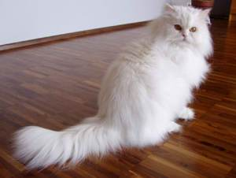Iako se kod nas ljudi najčešće odlučuju da
udome „običnu", domaću odnosno kućnu mačku, postoje ljubitelji koji žele
da znaju šta mogu da očekuju od svog ljubimca, odnosno odlučuju se za
mačku sa pedigreom. Takođe, rasne mačke ljudi biraju prema svom
karakteru, slobodnom vremenu (da li negovanje mačke zahteva više ili
manje vremena), ali i prema izgledu. Na ovoj listi se nalaze mace koje
ljudi najviše vole i za koje se najčešće odlučuju.

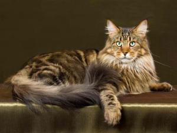1. **Persijska mačka** -- ovo je već dugo
jedna od najpopularnijih vrsta mačaka. Ove dugodlake mačke vuku korene
iz Irana, generalno se opisuju kao tihe životinje, dobre su za život u
stanu, odane su i verne ali je neophodno da se njihova dlaka češlja i
neguje svakog dana. Veoma su nežne i vole da im se posvećuje dosta
pažnje, a ponekad odaberu omiljenog člana porodice i samo njega slušaju
i vole da mu sede u krilu.

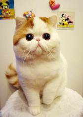2.** Mejn Kun** (u prevodu rakun iz Mejna) -- ova
mačka drži drugo mesto po popularnosti u Americi još od 1992. godine,
odmah iza Persijske. Veoma su inteligentne, razigrane i energične. Ovu
mačku zovu još i nežni div jer može da dostigne težinu i do 11 kg, ali
je uprkos tome veoma nežna i dobroćudna. Jako se dobro uklapaju u
porodice sa decom, a slažu se dobro čak i sa psima. Veoma su spretne i
dovitljive, pa su tako sposobne da vrlo lako dohvate hranu prednjim
šapama (poput rakuna) i na vrlo nepristupačnim mestima. Imaju običaj da
ubacuju svoje igračke u čašu ili posudu sa vodom, a umeju svojim šapama
i da otvaraju vrata. Veoma su živahne i radoznale mačke. Imaju
neobuzdanu potrebu da istražuju teritoriju i zato bi trebalo omogućiti
im svakodnevne aktivnosti. Ovo su prilično izdržljive mačke, ali mogu
dobiti oboljenja kao što su displazija kuka, policistični bubrezi i
hipertrofična kardiomiopatija. Iako ima dugo krzno kao Persijska mačka,
dovoljno je negovati ga i jednom nedeljno.

3. **Egzotična kratkodlaka mačka** -- kratkodlaka verzija persijske
mačke, još jedna nežna mačka željna vaše pažnje, ne voli da ostaje dugo
sama, a redovno negovanje krzna i čišćenje očiju se podrazumeva. Ovo je
relativno nova vrsta i ne nalazi se tako često. Sve varijante boje krzna
i očiju koje su dozvoljene kod persijskih mačaka, dopuštene su i kod
egzotičnih. Ima dobar temperament, mirna je, znatiželjna, razigrana i
voli dosta da se igra; uglavnom su slične karakteristike kao i kod
persijske mačke. Ne vole previše da ostaju same i često se veoma vežu za
svoje vlasnike. Kasno sazrevaju i ostaju razigrane čak i u starosti.

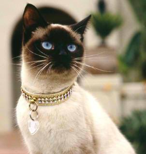4. **Sijamska mačka** -- prave galamdžijka
među mačkama, vodi poreklo iz Sijama (današnji Tajland), gde je
poštovana u budističkim hramovima, kao i na dvoru sijamskog kralja. U
Evropu stiže u drugoj polovini 19. veka, a u Ameriku početkom 20. veka.
Veoma su glasne, zvuče kao beba koja plače i umeju da budu izuzetno
otvorene i zahtevne, te ne može baš svako da živi sa njima. U stanju su
da satima „vode razgovore" sa vama ili pak same sa sobom. Razlozi za te
višesatne razgovore mogu biti različiti: glad, nedostatak pažnje ili
bilo šta drugo što je izazvalo njihovo negodovanje. Šta god da je razlog
njihovog nezadovoljstva, one će vam dati do znanja i to najvišim tonom
svog hrapavog glasa. Izuzetno su živahne i privržene, aktivne,
energične, društvene, znatiželjne i pričljive. Mogu živeti između 18 i
20 godina. Imaju veoma snažan karakter i njihovo prisustvo u kući se
uvek oseća. Nekada znaju da se ponašaju agresivno, naročito ukoliko
radite nešto što nije po njihovoj volji ili ne radite ono što bi one
želele. Vole pažnju i društvo, pa nije preporučljivo da ih dugo
ostavljate same. Dobro se slažu sa drugim mačkama, ali i sa psima. Veoma
su inteligentne i mogu da nauče dosta trikova. Obično se vežu za jednu
osobu i pružaju joj ogromnu količinu ljubavi. Sijamske mačke imaju
kratko, svilenkasto krzno bez poddlake, pa je njegovo održavanje vrlo
jednostavno i lako.

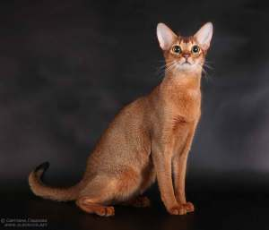5. **Abisinska mačka** je vrsta mačke za
koju se pretpostavlja da je najstarija rasa koja je pripitomljena i da
je potomak svete egipatske mačke. Prvi primerci ove rase stigli su u
Evropu oko 1800. godine iz Abisinije, po čemu je i dobila ime. Ovo je
vrlo temperamentna, inteligentna, radoznala, pristupačna i umiljata
mačka. Kao i druge mačke, ni ona ne voli da ostaje dugo sama, voli
društvo čoveka i različitih životinja. Mačka je vrlo dominantna, ali ne
u pogledu da drugima nameće svoju volju, nego zna druge da animira da se
njom bave ili da rade ono što ona u momentu želi. Svako ko je ima tvrdi
da je neodoljiva, a kada može slobodno da se kreće onda je najsrećnija.
Veoma je aktivna, pa bi bilo dobro da joj nađete neku zanimaciju da ne
bi postala destruktivna. Kratkodlako krzno ne zahteva previše nege i
lako ga je održavati.

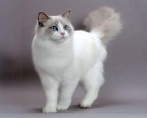6. **Ragdol (Ragdoll)** je mišićava, krupna dugodlaka
mačka koja obožava da sedi u krilu -- ona je poznata po tome što se
potpuno opusti i njeno telo omlitavi kada je podignete (kao krpena
lutka -- ragdoll). Ovo je mačka veoma blage naravi, razigrana i ne
previše zahtevna. Teži između 10 i 20 kg, ali je uprkos tome veoma nežna
i ljupka. Ova mačka ne bi trebalo da bude napolju bez nadzora jer neće
znati da se odbrani ako je napadne neka druga životinja pošto nije
rođeni lovac, a ni borac, tj. najviše vremena bi trebalo da provodi
unutra. Ne zahteva preterano održavanje i vrlo lako se dresira. Ragdoll
je odličan ljubimac posebno ako želite prijateljski raspoloženo i nežno
društvo koje će biti umiljato prema svima u vašem domu, pa čak i
gostima.

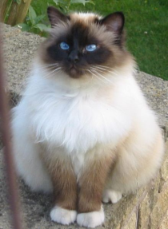7. **Birman** (Birmanska mačka, Burmanska
mačka) -- ako želite mačku koja će po karakteru ličiti na psa, onda je
ovo pravi izbor. Ovo je veoma druželjubiva mačka, veoma blage naravi i
izuzetno inteligentna. Izgleda kao dugodlaka verzija sijamske mačke, ima
izrazito plave oči i upečatljive bele šape. Voli da komunicira sa
ljudima, ali na mnogo tiši način za razliku od Sijamske mačke. Voli
dosta da se igra i da uči raznorazne trikove. Veoma voli društvo, pa se
vrlo dobro snalazi u društvu sa drugim životinjama. Ovo nije mačka koja
voli da se pentra po vašim policama i da se kači za zavese, tako da ćete
je načešće naći na zemlji tj. podu. Krzno zahteva minimalnu negu. Imaju
težnju ka gojenju pa povedite računa o njihovoj ishrani.

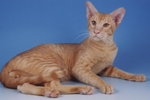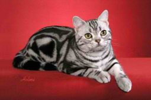8. **Američka kratkodlaka mačka** je veoma
izdržljiva, rođeni lovac, dobrog je zdravlja i poprilično tiha
životinja. Ovo je prava porodična mačka i veoma je dobra sa decom. Vole
da se igraju, kako svojim igračkama, tako i sa svim članovima porodice.
Nije im potrebna preterana nega (četkanje 1-2 nedeljno) i veoma dugo
žive, do 20 godina. Veoma liči na našu domaću mačku, ali se ipak
razlikuje po određenim pojedinostima.

9. **Orijentalna mačka** i po izgledu i po karakteru veoma podseća na
Sijamsku mačku, ali se boja njenog krzna javlja u oko 300 različitih
nijansi, a takođe mogu biti kratkodlake ili dugodlake. Temperament veoma
podseća na Sijamsku mačku, ali je ova vrsta dosta tiša. Po naravi su
društvene, odane, znatiželjne, 'pričljive' i zahtevne, potrebno im je
mnogo aktivnosti. Uglavnom imaju dug životni vek, premda pojedine pate
od naslednih srčanih problema. Kao i Sijamske, i ove mačke su veoma
mobilne, stalno su u pokretu. Veoma su znatiželjne. Učestvuju u svemu
sto se događa u porodici sa kojom žive. Kontrolišu sve što se donese u
kuću, ulaze u kesu da vide šta ste doneli. Ne vole nered i buku, i
vrisku dece. Veoma su uredne.

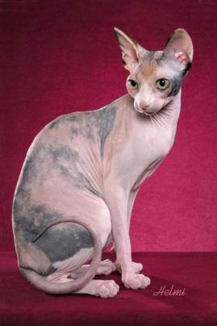10.** Sfinks mačka** je prepoznatljiva jer je
bezdlaka, tj nema krzno. Sfinks mačke dolaze u raznim kombinacijama
boja, a koža im je u onoj boji u kojoj bi bilo krzno kod normalne mačke.
Ova vrsta nema brkove, a oko njuške, na ušima i ramenima može se
pojaviti naborana koža. Zbog nedostatka dlake, morate da vodite računa
da njihovo telo ne izgubi toplotu -- zbog toga ih vlasnici često puštaju
da se zavuku pod ćebe dok spavaju i na taj način se osećaju prijatno.
Sfinks su jako inteligentne i privržene mačke, glasne i „pričljive".
Vole da budu deo porodice i dobro se slažu sa decom i psima, a rado će
deliti kuću i sa drugom mačkom, najbolje još jednom iz sfinks vrste.
Postoje i vrste mačaka, na primer sijamske, koju sfinks mačke ne
podnose. Iako nemaju krzno, veoma je preporučljivo da ih obrišete
vlažnim maramicama ili vlažnim sunđerom ako želite da vam nameštaj
ostane čist jer se ove mačke prirodno znoje. Imaju veoma brz metabolizam
pa im je apetit ogroman -- jedu mnogo, nisu izbirljive, ali nema
opasnosti da će se ugojiti. Iako nemaju krzno, ove mačke nisu
antialergijske pa se ne preporučuju ljudima koji su alergični na mačiju
dlaku. Telo joj je veoma osetljivo na sunce pa se preporučuje da joj
namažete kremu za sunčanje kada se nalazi napolju i kada je toplo. Kako
nemaju dlake na ušima koje bi ih zaštitile od nakupljanja prljavštine,
uši je potrebno redovno čistiti vlažnom krpom. Oči nemaju trepavice i
često se u uglovima skuplja sluz pa je potrebna dodatna nega, kao i
redovna kontrola područja oko kandži.

Tabela ispod sumira 8 klasifikacija domaćih mačaka (uključujući obične
domaće, koje nemaju pedigre).

  -----------------------------------------------------------------------
  a\)               Dugodlake         b\)               Britanske i
                    Persijske                           Američke
                                                        kratkodlake
  ----------------- ----------------- ----------------- -----------------
  c\)               Dugodlake         d\)               Druge rase
                    nepersijske                         kratkodlakih

  e\)               Orijentalne       f\)               Sijamske
                    kratkodlake                         

  g\)               Birmanske         h\)               Obične (bez
                                                        pedigrea)
  -----------------------------------------------------------------------

8.  **Od koje koristi su mačke za čoveka?**

Mačke love miševe i pružaju prijateljstvo. Oni se koriste u Kini i
Japanu da se zaštite čaure svilenih buba od pacova.

9.  **Sa slika ili posmatranjem prepoznaj sedam vrsta divljih mačaka.
    Kaži u kom delu sveta se nalaze.**

```{=html}
<!-- -->
```
1.  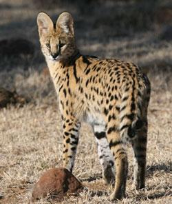Serval

> Serval je jedna od najupečatljivijih mačaka savane. Može da se sretne
> širom srednje i južne Afrike kao i u severozapadnoj Africi. Male
> glave, tačkastog krzna i dugih nogu, može da skoči i do 3 metra.
>
> Težina mu se kreće od 7 kg do 18 kg, a dužina tela od 59 cm do 92 cm
> sa relativno kratkim, prstenovima okruženim repom sa crnim vrhom. Lovi
> sitne životinje i najviše voli život pored vode. Hrani se zečevima,
> žabama i vevericama. Dobro se penje i često hvata ptice u letu. Serval
> je solitarna mačka koja u potrazi za hranom prelazi i do 4 kilometara
> svake večeri. Ukrštanjem servala sa domaćom mačkom dobijen je hibrid
> -- Savana mačka.

2.  Ris

> 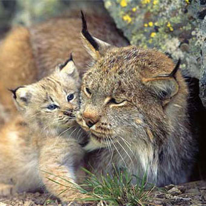Ris je mačka srednje veličine, dugih
> nogu i velikih ušiju sa čupercima na vrhovima i kratkim repom. Smatra
> se da dugi čuperci na ušima pomažu risu da dobro čuje u gustim šumama
> u kojima se zvuk neprenosi nadaleko. Boja tela je od svetlo smeđe do
> sive. Zimi su velika stopala pokrivena gustim krznom koje služi kao
> koplje i sprečava da ris potone u sneg. 
>
> Razlikujemo običnog, kanadskog, pirinejskog i crvenog risa. Obični ris
> je znatno veći od ostalih vrsta risova. Odrasli risovi su teški od 15
> kg do 30 kg. Uglavnom živi samotnjačkim životom. Sezona parenja je u
> kasnu zimu i ženke obično donose na svet od 2 do 4 mladunca godišnje.
> Majka se brine za mlade oko godinu dana. Hrani se pticama, malim
> sisarima i ribama, ali i većim sisarima. Ris obično lovi na tlu.

3.  Puma

> 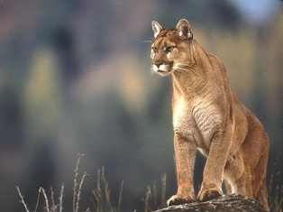Puma je prilagodljiva mačka, naviknuta
> na negostoljubive vetrovite obale vrha Južne Amerike, kao i na padine
> planine Kolorado u zapadnom delu SAD. Takođe, puma živi i u tropskim
> šumama Amazona. Krije se po stenovitim mestima i dobar je penjač, pa
> se retko viđa iako lovi danju i noću.
>
> Ima dug krzneni rep crnog vrha, dok boja krzna može da bude različita,
> ali je na trbuhu uvek bela. Može trčati do 50 km/h, s mesta može
> skočiti 6 metara. Zadnje noge su duže od prednjih. Odrasli mužjak
> dostiže težinu od 70 kg, a ženke do 35 kg. Mačići pume su prekriveni
> crno - smeđim tačkicama, a rep im je savijen u krug.

4.  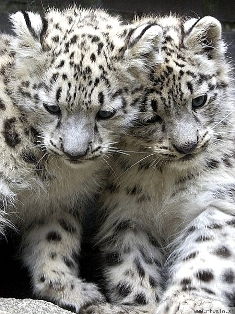Snežni leopard\
    Snežni leopard je krupna, retka mačka koja živi samo u visokim
    planinama centralne Azije. Ovu mačku odlikuje proporcionalno duži
    rep od ostalih mačaka koji joj pomaže da održi ravnotežu prilikom
    skokova na neravnom terenu. Noge su kratke i jake, sa širokim šapama
    i kandžama.

> Snežni leopard može da skoči 15 metara u daljinu. Težina im se kreće
> od 30 kg do 80 kg. Love sami. Hrane se divokozama, zečevima i hrčcima.
> Snežni leopardi su samotnjaci. Mužjak i ženka se sreću samo u toku
> parenja, između januara i marta. Ženka donosi na svet obično dva do
> tri mladunca. Uz majku ostaju od 18 do 22 meseca.
>
> Snežni leopardi su ugrožene mačke čije je krzno izuzetno skupo na
> crnom tržištu. Na velikoj ceni su i leopardove kosti, zubi i
> unutrašnji organi koji se koriste u narodnoj medicini. Ukupna
> populacija snežnih leoparda u divljini je između 3.500 i 7.000. Još
> 600 - 700 primeraka živi u zatočeništvu širom sveta.

5.  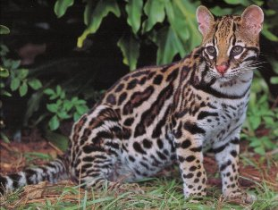Ocelot\
    Divlja mačka sa staništem u Južnoj i Srednjoj Americi, Meksiku i u
    SAD-u. Naraste do 1 metar uz prosečnu težinu od 10 kg do 15
    kilograma. Iako se vrlo dobro snalazi na drveću, najviše vremena
    provodi na tlu. Pretežno lovi noću i to životinje koje su manje od
    njega prateći njihov miris, iako ima vrlo razvijen vid.

> Oceloti često žive u parovima i svi su uglavnom dobri plivači. Ženka
> nosi 70 dana, nakon kojih na svet donosi 2 - 4 ocelota. Šumski oceloti
> imaju tamnije krzno od onih koji nastanjuju šipražje. Zbog toga što
> imaju pruge oko vrata, u Kini su poznati kao mali tigrovi.

6.  Leopard

> 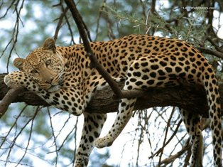Leopard živi na pošumljenim pašnjacima Afrike i
> južne Azije i najveća je mačka koje se redovno penje na drveće.
> Krupniji su od geparda. Težina im se kreće od 30 kg do 80 kg. Love
> noću. Hrane se sa 90 različitih vrsta sisara. Najčešće se hrane
> Tomsonovim gazelama i majmunima. Leopardi žive samostalno. Sastaju se
> samo u sezoni parenja. Retko se viđaju i majstori su za
> prerušavanje. \
> Leopardi mogu da se pare tokom cele godine ali se najčešće pare u
> januaru ili februaru. Trudnoća traje otprilike 46 dana i najčešće se
> rađa jedan do dva mladunca. Majke zbrinjavaju mladunce dok ne napune 2
> godine. Broj leoparda je ugrožen, uglavnom zbog njihovih boravišta,
> ali i zbog veoma traženog krzna.

7.  Jaguar

> 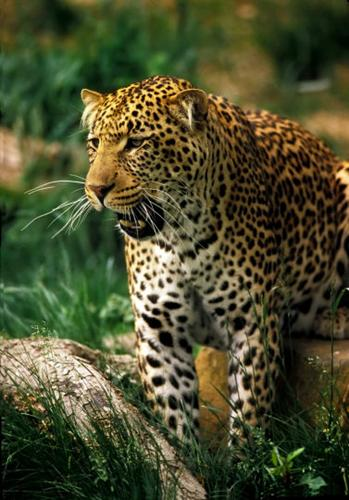Jaguar je jedina velika mačka koja može
> da se nađe na američkom kontinentu. Naseljavaju prostor Centralne i
> Južne Amerike. Najprijatnije se oseća u gustim tropskim šumama Južne
> Amerike. DNK analize jaguara dokazuju da se on nalazi u istoj grupi sa
> lavovima i tigrovima. Dobar je plivač, a omiljena hrana su mu rečne
> kornjače. Dostiže težinu oko 70 kg -- 120 kg.
>
> Jaguar ima odlično čulo vida, kao i sluha koji mu omogućava da prati
> plen. Vidi dobro po danu, a takođe ima osetljiv vid i noću, što mu
> omogućava da lovi na mesečini, ili svetlosti zvezda. Uglavnom lovi na
> zemlji, ali se često penje na drveće i čeka svoj plen.Vilica jaguara
> je jedno od njegovih najjačih oružija, što mu daje titulu životinje sa
> najsmrtonosnijim ugrizom od svih velikih mačaka. Ima najjači ujed od
> svih mačaka, a drugi na nivou sisara! \
> Odrasli jaguari su solitarni; ženke i mužjaci su zajedno u divljini
> samo tokom sezone parenja. Ženka rađa 1 - 4 mladunca koji su slepi pri
> rođenju i teški samo 250 - 300 g. Sa šest meseci starosti počinju da
> love zajedno sa majkama. Mladunci ostaju uz majke dve godine pre nego
> što se odvoje i započnu borbu za sopstvenu teritoriju.\
> Iako je danas zaštićen, jaguaru preti opasnost od istrebljenja zbog
> neprekidnog uništavanja njegovih šumskih staništa i ubijanja zarad
> izuzetno lepog krzna išaranog sa tačkicama.

8.  Gepard

> 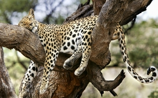U dalekim savanama Afrike živi najbrža
> životinja sveta - GEPARD. \
> Duge noge i savitljiva kičma omogućavaju mu da trči brzinom od 96
> km/h. Gepard ne može da riče i jedina je mačka koja juri za plenom.
> Uglavnom se hrani Tomsonovim gazelama. Težina im se kreće od 36 kg do
> 65 kg. Ženka na svet obično donese tri mladunca, sa kojima ostaje
> zajedno naredne  2 godine. Mladunci tokom svoje prve godine života uče
> tehnike lova. Ženke geparda žive same i čuvaju svoj posed
> dozvoljavajući mužjacima da se približe samo kad su u teranju. Za
> razliku od njih, mužjaci često žive zajedno u maloj grupi, ali se sa
> ženkom pari samo glavni mužjak.
>
> Danas je geparda sve manje! Pretpostavlja se da ih je ostalo svega
> 7000 -- 10 000. U parkovima sveta netaknute prirode njihove
> svakodnevne navike često remete turisti. Mada ih zakon štiti, zbog
> krzna ih i dalje ubijaju lovokradice.

9.  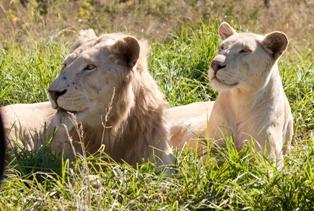Lav\
    Lav je veliki sisar iz porodice mačaka. Mužjak lava teži između
    200 - 260 kilograma. Ženke su manje i teže od 130 - 180 kilograma. U
    divljini lavovi žive oko 10 - 14 godina dok u zatočeništvu preko 20
    godina.

> Nekada su živeli širom Afrike, Azije i Evrope, dok se danas u divljini
> mogu naći samo u Africi. Žive u savanama u čoporu. Sastav čopora se
> menja, ali broj ženki je uvek veći od broja mužjaka. Lavice su jezgro
> svakog  čopora i drže se zajedno sa sestrama, tetkama i kćerkama.
>
> Love noću ili u zoru u čoporu, dok mužjacima pripada glavno mesto pri
> ubijanju. Uglavnom love krupnije sisare: antilope, zebre, gnuove i
> bivole. Mladi lavovi počnu da love kada su stari tri meseca, ali tek
> sa dve godine postanu uspešni lovci. Razvijaju brzinu od 50 km/h.
> Čopor uglavnom ima 4 - 6 članova, ali i do 30 članova. Pare se u toku
> cele godine. Za vreme parenja lavovi se pare 20 - 40 puta na dan.
> Trudnoća traje od 100 - 120 dana, posle čega ženka donosi na svet 1- 4
> mladunčeta.

10. Tigar

> Tigar je najveća i najjača mačka na
> svetu. Može dostići težinu od 109 kg do 227 kg. Pre 100 godina u
> divljini je živelo skoro 100 000 tigrova, a danas ih u svetu ima 3 200
> -- 3 500.
>
> U prošlosti, tigar je naseljavao prostore od Turske, na zapadu, pa sve
> do obala Rusije i Kine, na istoku, i od Sibira, na severu, do
> Indonežanskih ostrva Bali, na jugu. Danas tigar živi u južnoj i
> istočnoj Aziji. U zatočeništvu oni su vrlo privržene životinje i jako
> su vezani za čoveka. U divljini žive oko 8 -- 10 godina. \
> Tigrovi obožavaju vodu i veoma su inteligentni. Uglavnom love noću,
> većinu plena čine jeleni i divlje svinje, ali se hrani i manjim
> životinjama -- majmunima, pticama, gmizavcima i ribama. Napada i male
> nosoroge i slonove. Odjednom mogu pojesti i do 40 kg mesa. Iako obično
> ne ubijaju ljude, tigrovi ponekad postaju ljudožderi! Do toga obično
> dolazi bilo zato što su suviše stari ili onemoćali da bi ubijali
> divlje životinje bilo zato što ljudi love ribu ili rade na njihovom
> prostoru, te plaše njihov prirodni plen.

10. **Koja životinja je poznata kao car životinja? Zašto ima tu titulu?
    Kakav joj je stvarni temperament?**

Lav je poznat kao *car životinja*. Ovo doseže toliko daleko koliko i
poznata istorija, zato što se grčka reč za *lav* prevodi kao *car* na
Latinskom. Lav je dobio ovaj epitet zato što se ne boji ni jedne druge
životinje. Takođe se kaže da je lav nazvan *carem svih životinja* zbog
svoje hrabrosti i odanosti. U njegovu hrabrost se ne može posumnjati,
ali lav nije posebno odan. Zna se da muški lavovi preuzmu čopor ženki
tako što oteraju (ili ubiju) njihovog/njihove mužjaka/e. Oni često
oforme *koalicije* od dva do pet mužjaka i rade zajedno na tome da zbace
druge mužjake. Kada su uspešni u tome, oni tada ubiju bilo koje mladunce
u čoporu tako da će se ženke ranije početi pariti. Ženke nekada
pokušavaju da brane mladunce, ali u tome su retko uspešne. Ove koalicije
mužjaka ne ograničavaju njihove aktivnosti na samo jedan čopor.
Koalicija može da dominira nad nekoliko čopora unutar njihove
teritorije. Nije baš ugled za odanost! (Ali na kraju krajeva, ni ljudski
carevi nisu).

11. **Ispričaj priču o Androklu i lavu**

Androkle je bio Rimski rob koji je pobegao i sakrio se u pećini. Jednog
dana, lav je prišao pećini, teško šepajući. Androkle je pregledao šapu i
uklonio veliki trn. Lav je bio izlečen i smiren od Androkla i takođe
živeo u pećini sa Androkleom dok Androkle kasnije nije bio uhvaćen.
Androkle je bio umoran i osuđen da bude raskidan na komade od gladnog
lava. Tog dana, lav, koji je bio izabran da ga uništi, počeo je da liže
njegovo lice i ruke sa očiglednom privrženošću, umesto da ga pojede. To
je bio isti lav sa kojim se Androkle sprijateljio u pećini. Osobe u
vlasti su bile pokrenute ovim prikazom privrženosti. Car je oprostio i
oslobodio Androkla. Oni su takođe dozvolili Androklu da drži lava kao
prijatelja i zato je mogao da se šeta ulicama Rima sa njim.

12. **Navedi četiri priče iz Biblije u kojoj se spominje član porodice
    mačaka.**

-   Samson i lav (Sudije 14)

-   David je ubio lava i medveda (1. Samuilova 17:36)

-   Lav je ubio neposlušnog proroka (1. Carevima 13)

-   Venaja je ubio lava u snežnoj jami (1. Dnevnika 11:22)

-   Tele i lavić će zajedno ležati na nebu (Isaija 11:6,7)

-   Može li leopard promeniti svoje šare? (Jeremija 13:23)

-   Danilo u Lavovskoj jami (Danilo 6)

-   Danilov san o lavu sa krilima i leopardom sa četiri glave (Danilo 7)
