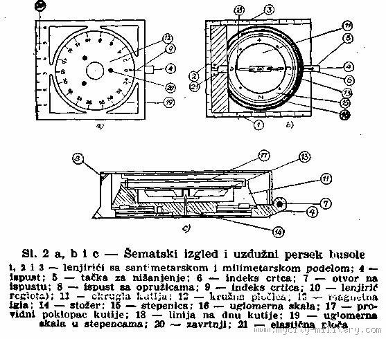

# 1. Objasni šta je topografska mapa, šta očekuješ da nađeš na njoj i tri moguće koristi.

Topografske mape se često zovu konturne mape ili „topo mape".
Topografske mape obično pokazuju topografiju, ili konture zemlje uz
pomoć konturnih linija. Konturne linije su krive koje povezuju susedne
tačke iste visine. Drugim rečima, svaka tačka na liniji obeleženoj sa
100m visine je 100m iznad nivoa mora.

Osim što pokazuje visinu preko kontura, može se takođe očekivati od mape
da pokaže bitna prirodna obeležja kao što su reke, jezera i putevi. One
će često pokazati i železničke šine i glavne strujne vodove (i njihove
dalekovode). Strujni vodovi su posebno korisni zbog tog što su
dalekovodi vidljivi sa velikih daljina i svaki predstavlja tačku na mapi
(dok bi put ili reka predstavljali krivu liniju). Ove osobine ih čine
idealnim za detaljnije definisanje pozicije.

Topografske mape imaju puno koristi, omogućujući veštom korisniku da
odredi sledeće:

-   Gde se nalazi

-   Kako da stigne do željene destinacije

-   Kako izgleda teren na određenom prostoru (npr. strmost)

-   Odakle reka dotiče i gde otiče

-   Put kuda ide staza za planinarenje

-   Lokacije I mesta za kampovanje

-   Razdaljina između dve tačke

-   Nadmorska visina vrha planine

-   Geografska visina i širina bilo koje tačke na mapi

-   Koje oblasti bi bile moguće da se poplave ili da ih zadesi lavina

# 2. Prepoznaj barem 20 znakova i simbola koji se koriste na topograskim mapama

Znakove za objekte prikazujemo tačkastim (a) ili površinskim znakom (b).

+----------+------------+---------+------------+---------+----------+
| **znak** | **         | *       | **         | *       | **zn     |
|          | značenje** | *znak** | značenje** | *znak** | ačenje** |
+==========+============+=========+============+=========+==========+
| ![]      | zgrada     | {widt |            | 3.gif){ |            |         |          |
| h="0.572 |            | width=" |            |         |          |
| 91666666 |            | 0.25in" |            |         |          |
| 66666in" |            | hei     |            |         |          |
| height   |            | ght="0. |            |         |          |
| ="0.5208 |            | 375in"} |            |         |          |
| 33333333 |            |         |            |         |          |
| 3334in"} |            |         |            |         |          |
+----------+------------+---------+------------+---------+----------+
| ![]      | tvrđava    |         | spomenik   |         | dvorac   |
| (media/o |            |         |            |         |          |
| rjentiri |            |         |            |         |          |
| ng - min |            |         |            |         |          |
| i/media/ |            |         |            |         |          |
| image4.e |            |         |            |         |          |
| mf){widt |            |         |            |         |          |
| h="0.822 |            |         |            |         |          |
| 91666666 |            |         |            |         |          |
| 66666in" |            |         |            |         |          |
| height   |            |         |            |         |          |
| ="0.6145 |            |         |            |         |          |
| 83333333 |            |         |            |         |          |
| 3334in"} |            |         |            |         |          |
+----------+------------+---------+------------+---------+----------+
| ![]      | stadion    | {widt |            | 6.emf){ |            | edia/or |          |
| h="0.864 |            | width=" |            | jentiri |          |
| 58333333 |            | 0.86458 |            | ng - mi |          |
| 33334in" |            | 3333333 |            | ni/medi |          |
| hei      |            | 3334in" |            | a/image |          |
| ght="0.5 |            | hei     |            | 7.gif){ |          |
| 9375in"} |            | ght="0. |            | width=" |          |
|          |            | 2083333 |            | 0.64414 |          |
|          |            | 3333333 |            | 6981627 |          |
|          |            | 334in"} |            | 2966in" |          |
|          |            |         |            | he      |          |
|          |            |         |            | ight="0 |          |
|          |            |         |            | .447916 |          |
|          |            |         |            | 6666666 |          |
|          |            |         |            | 667in"} |          |
+----------+------------+---------+------------+---------+----------+
| {w |            | .gif](m |            | image10 |          |
| idth="0. |            | edia/or |            | .gif){w |          |
| 78125in" |            | jentiri |            | idth="0 |          |
| hei      |            | ng - mi |            | .375in" |          |
| ght="0.5 |            | ni/medi |            | he      |          |
| 9375in"} |            | a/image |            | ight="0 |          |
|          |            | 9.gif){ |            | .385416 |          |
|          |            | width=" |            | 6666666 |          |
|          |            | 0.73958 |            | 667in"} |          |
|          |            | 3333333 |            |         |          |
|          |            | 3334in" |            |         |          |
|          |            | he      |            |         |          |
|          |            | ight="0 |            |         |          |
|          |            | .516817 |            |         |          |
|          |            | 5853018 |            |         |          |
|          |            | 373in"} |            |         |          |
+----------+------------+---------+------------+---------+----------+
| {widt |            | 2.gif){ |            | 3.emf){ |          |
| h="0.864 |            | width=" |            | width=" |          |
| 58333333 |            | 0.86597 |            | 0.82291 |          |
| 33334in" |            | 2222222 |            | 6666666 |          |
| height   |            | 2223in" |            | 6666in" |          |
| ="0.5729 |            | heigh   |            | he      |          |
| 16666666 |            | t="0.28 |            | ight="0 |          |
| 6666in"} |            | 125in"} |            | .614583 |          |
|          |            |         |            | 3333333 |          |
|          |            |         |            | 334in"} |          |
+----------+------------+---------+------------+---------+----------+
|          | antenski   |  | iring - |            | g - min |          |
|          |            |  mini/m |            | i/media |          |
|          |            | edia/im |            | /image1 |          |
|          |            | age14.e |            | 5.gif){ |          |
|          |            | mf){wid |            | width=" |          |
|          |            | th="0.9 |            | 0.55208 |          |
|          |            | 0625in" |            | 3333333 |          |
|          |            | hei     |            | 3334in" |          |
|          |            | ght="0. |            | he      |          |
|          |            | 1770833 |            | ight="0 |          |
|          |            | 3333333 |            | .354166 |          |
|          |            | 334in"} |            | 6666666 |          |
|          |            |         |            | 667in"} |          |
+----------+------------+---------+------------+---------+----------+
| {widt |            | age17.e |            | 8.emf){ |          |
| h="0.260 |            | mf){wid |            | width=" |          |
| 41666666 |            | th="0.9 |            | 0.70997 |          |
| 66667in" |            | 0625in" |            | 8127734 |          |
| height   |            | heigh   |            | 0332in" |          |
| ="0.3486 |            | t="0.15 |            | he      |          |
| 11111111 |            | 625in"} |            | ight="0 |          |
| 1111in"} |            |         |            | .385416 |          |
|          |            |         |            | 6666666 |          |
|          |            |         |            | 667in"} |          |
+----------+------------+---------+------------+---------+----------+
| !        | aerodrom   | {w |            | age20.e |            | 1.emf){ |          |
| idth="0. |            | mf){wid |            | width=" |          |
| 90625in" |            | th="0.9 |            | 0.83333 |          |
| height   |            | 0625in" |            | 3333333 |          |
| ="0.7709 |            | heig    |            | 3334in" |          |
| 88626421 |            | ht="0.1 |            | he      |          |
| 6973in"} |            | 875in"} |            | ight="0 |          |
|          |            |         |            | .385416 |          |
|          |            |         |            | 6666666 |          |
|          |            |         |            | 667in"} |          |
+----------+------------+---------+------------+---------+----------+
| !        | Železnička | {w |            | age23.e |            | 4.emf){ |          |
| idth="0. |            | mf){wid |            | width=" |          |
| 90625in" |            | th="0.9 |            | 0.83333 |          |
| height   |            | 0625in" |            | 3333333 |          |
| ="0.7315 |            | he      |            | 3334in" |          |
| 50743657 |            | ight="0 |            | hei     |          |
| 0429in"} |            | .385416 |            | ght="0. |          |
|          |            | 6666666 |            | 375in"} |          |
|          |            | 667in"} |            |         |          |
+----------+------------+---------+------------+---------+----------+
| {widt |            | 6.emf){ |            | 7.emf){ |          |
| h="0.864 |            | width=" |            | width=" |          |
| 58333333 |            | 0.61458 |            | 0.83333 |          |
| 33334in" |            | 3333333 |            | 3333333 |          |
| height   |            | 3334in" |            | 3334in" |          |
| ="0.4791 |            | he      |            | he      |          |
| 66666666 |            | ight="0 |            | ight="0 |          |
| 6667in"} |            | .385416 |            | .385416 |          |
|          |            | 6666666 |            | 6666666 |          |
|          |            | 667in"} |            | 667in"} |          |
+----------+------------+---------+------------+---------+----------+
| !        | Slap ili   | {w |            | 9.emf){ |            | 0.emf){ |          |
| idth="0. |            | width=" |            | width=" |          |
| 90625in" |            | 0.45833 |            | 0.36458 |          |
| hei      |            | 3333333 |            | 3333333 |          |
| ght="0.3 |            | 3333in" |            | 3333in" |          |
| 4375in"} |            | he      |            | hei     |          |
|          |            | ight="0 |            | ght="0. |          |
|          |            | .441358 |            | 4121380 |          |
|          |            | 2677165 |            | 1399825 |          |
|          |            | 354in"} |            | 023in"} |          |
+----------+------------+---------+------------+---------+----------+
| { |            | edia/im |            | edia/im |          |
| width="0 |            | age32.e |            | age33.e |          |
| .6875in" |            | mf){wid |            | mf){wid |          |
| height   |            | th="0.9 |            | th="0.4 |          |
| ="0.3504 |            | 0625in" |            | 6875in" |          |
| 89938757 |            | heigh   |            | he      |          |
| 6553in"} |            | t="0.53 |            | ight="0 |          |
|          |            | 125in"} |            | .451388 |          |
|          |            |         |            | 8888888 |          |
|          |            |         |            | 889in"} |          |
+----------+------------+---------+------------+---------+----------+

# 3. Prepoznaj delove busole

Ručne busole su uglavnom slične, ali ima i
razlike. Prilikom polaganja ovog pitanja, izviđač treba da opiše delove
busole po izboru. Ručna busola M53 je jedna od najboljih i
najpouzdanijih busola koja se može naći u prodaji na našim prostorima,
zbog čega ćemo pregledati delove upravo ove busole. M53 sadrži tri
glavna dela: osnovu, srednji deo (telo ili limb) i poklopac.

a\) Osnova je metalna ploča kvadratnog oblika

Njeni delovi su:

-   lenjirići sa cm i mm podelom (za merenje duži na karti, kao
    koordinatomer)

-   spust, za koji se vezuje kanap i busola drži pri upotrebi

-   tačka, koja se koristi pri nišanjenju

-   indeks crtica, služi za čitanje azimuta u hiljaditima;

-   otvor na ispustu, kroz koji se provlači kanap (pri merenju mesnih
    uglova i ugaonih rastojanja)

-   ispust sa opružicama, služi za postavljanje poklopca u željeni
    položaj

-   indeks crtica, služi za čitanje azimuta u stepenima

-   lenjirić (regleta), služi za merenje ugaonih rastojanja.

> b\) Srednji deo sastoji se iz okrugle kutije i kružne pločice.
>
> Njegovi delovi su:

-   magnetna igla (sevrna strana je fluorescentno obelezena)

-   osovina (stozer) , na kojoj se magnetna igla slobodno okreće

-   oznake strana sveta S-J-I-Z ili na eng. N-S-E-W (pomocne strane
    sveta obelezene su tackicama)

-   uglomerna skala, sa podelom u hiljaditima (gornja)

-   uglomerna skala, sa podelom u stepenima (donja)

-   providni poklopac kutije (staklo)

-   linija na dnu kutije (koja olakšava da
    se magnetna igla dovede u položaj sjever --- jug)

> c\) Poklopac je metalan, a za osnovu je pričvršćen poluosovinama.
>
> Delovi poklopca su:

-   elastična ploča, koja poklopac drži za ispust osnove

-   zarez za nišanjenje

-   ogledalo (sa unutrašnje strane poklopca), služi za promatranje
    magnetne igle pri nišanjenju

-   uzdužna linija (sa izgraviranim znacima prednjeg i zadnjeg nišana)
    služi za dovođenje busole u pravac nišanjenja

-   poprečne crte (pri dnu ogledala), za približno iznalaženje horizonta
    oka

-   uzdužni prorezi (na bočnim spoljnim stranama poklopca) za
    nišanjenje, sa skalama sa strane proreza --- za merenje mesnih
    uglova.

# 4. Definiši sledeće izraze

> **a. Visina**
>
> Visina tačke u odnosu na nivo mora.
>
> **b. Konturni interval**
>
> Promena u visini između dve susedne konturne linije na topografskoj
> mapi. Ako putuješ od jedne konturne linije do druge, tvoja promena u
> visini je jednaka konturnom intervalu.
>
> **c. Magnetni sever**
>
> Magnetni sever je pravac koji magnetna igla busole pokazuje, koji je
> prema severnom magnetnom polu. Severni magnetni pol nije na istom
> mestu kao i geografski severni pol. Severni magnetni pol je tačka na
> Zemljinoj površini gde Zemljino magnetno polje upućuje direktno dole.
> Ovaj pol se stalno pomera. 2005. Godine je bio na 82,7° N 114,4° W.
>
> **d. Deklinacija (Odstupanje)**
>
> Ugaona razlika između magnetnog severa i pravog severa (definisana u
> odnosu na Geografski Severni Pol), na bilo kojoj lokaciji na Zemljinoj
> površini, zove se magnetna deklinacija (ili magnetno odstupanje).
> Drugim rečima, to je koliko je pomeren kompas od „pravog severa", ili
> ispravka koja treba da se primeni na čitanje kompasa.
>
> **e. Razmera**
>
> Važni sadržaj mape je razmera. Ona može da se obeleži ili skalom ili
> odnosom 1:n. Ona omogućuje korisniku mape da meri razdaljinu na mapi i
> odredi razdaljinu na zemlji. Ovih dana mape se uglavnom proizvode pod
> metričnim sistemom, što olakšava posao za izvršavanje zadataka. Mape
> se uglavnom proizvode u standardnoj razmeri od (npr.) 1:10,000 ili
> 1:50,000 ili 1:100,000 i sve što trebaš da učiniš je da napraviš
> merenje na mapi (u mm) i pomnožiš tu vrednost sa brojem pored faktora
> razmere da bi se odredila razdaljina na zemlji. Ipak, neke mape iz
> nekih zemalja mogu da koriste imperijalne jedinice, posebno starije
> mape. Ove mape prikazuju razmeru ali su često bile u formi 60 lanaca
> (lanac je 22 jarde, ili 66 stope) sprem 1 inča ili 2 milje sprem 1
> inča, itd.
>
> **f. Merenje**
>
> Postupak određivanja udaljenosti na mapi i prenošenja na udaljenost na
> zemlji. Da bi seo obavilo ovo prenošenje, potrebno je znati razmeru
> mape. Merenje se može napraviti lenjirom, šublerom ili ivicom ručne
> busole.
>
> **g. Obrnuti azimut**
>
> Pogledaj pod pojmom „Azimut"
>
> **h. Geografski sever**
>
> Geografski sever je pravac sa bilo koje tačke Zemljine površine ka
> Geografskom Severnom Polu
>
> **i. Azimut**
>
> Azimut je ugao, obično meren u stepenima, između pravca severa i
> određene tačke. Postoji 360° (stepeni) u krugu. Sever se nalazi na 0°
> (ili 360°), istok na 90°, jug na 180° i zapad na 270°. Dok azimut
> predstavlja ugao igle na kompasu u željenom pravcu, „obrnuti azimut"
> predstavlja tačno obrnuti pravac. Drugim rečima, azimut je pravac u
> kom se ide, a obrnuti azimut je pravac odakle dolaziš. Obrnuti azimut
> se može izračunati dodavanjem ili oduzimanjem 180° od azimuta. Dodati
> ukoliko je azimut manji od 180°, ili oduzeti ukoliko je veće.
>
> **j. Udaljenost**
>
> Udaljenost je izmerena razdaljina između dve određene tačke.

# 5. Pokaži kako se određuje azimut na zemljištu

-   poklopac busole se postavi pod uglom od oko 60 stepeni (prema
    osnovi);

-   busola se uzima u levu ruku tako da palac bude s leve strane
    ispusta, a kažiprst  i srednji  prst  na  prednjoj   strani osnove;

-   Ruka se ispruži tako da busola stoji vodoravno, a desnom rukom se
    drži kraj kanapa;

-   nanišani se na tačku (predmet, objekt, cilj) čiji se azimut meri;

-   zadržavajući isti položaj busole, kutija se palcem leve ruke okreće
    sve dok severni krak magnetne igle ne bude poravnat sa trouglićem na
    stepenici (pri čemu se koristi ogledalo), posle čega se busola
    spušta i na poleđini pročita vrednost azimuta (na poleđini ručne
    busole m53 broj na kružnoj skali se pomnoži sa 10 kako bi se dobila
    prava vrednost stepeni ).

> Ukoliko busola nema poklopac, onda se koristi druga metoda.

-   Busola se drži sa obe šake tako da se sa palcem jedne ruke može
    > okretati limb.

-   Laktovi se povuku da stoje čvrsto iznad kukova a busola se malo
    > izdigne kako bi bila na sredini između brade I pojasa;

-   nanišani se na tačku (predmet, objekt, cilj) čiji se azimut meri;

-   zadržavajući isti položaj busole, okreće se limb dok se ne poklopi
    > severni krak magnetne igle sa linijama koje pokazuju 0°.

-   Posle toga se busola podigne i očita tačna vrednost azimuta.

# 6. Pokaži kako se pronalazi tačka na zemljištu čiji je azimut poznat

-   prvo treba pronaći tačku na zemljištu sa koje je azimut izmeren,
    zatim postupiti na sledeći način:

-   busolu otvoriti, naći zadati azimut na limbu i okretanjem ga dovesti
    prema indeks-crtici,

-   zatim busolu postaviti u položaj za nišanjenje i okrećući se na
    mjestu (zajedno sa busolom) severni krak magnetne igle dovesti prema
    trouglu na stepenici.

-   Na kraju u nišanskoj liniji treba uočiti tačku čiji je azimut
    poznat.

# 7. Znati kako da se ispravi deklinacija i kada je ona potrebna

Pošto se magnetni sever razlikuje po položaju od geografskog severa, sa
različitih tačaka na svetu busola će manje ili više tačno upućivati na
geografski sever. Na zemaljskoj kugli postoje dve linije od severa do
juga na kojima nema deklinacije, nego gde busola pokazuje tačan smer. Na
nekim mestima to može da bude 30° a negde I 40°, što je velika razlika.
Pošto se mape uglavnom crtaju tako da upućuju na geografski sever,
potrebno je da uzmemo u obzir I deklinaciju.

U Srbiji I Makedoniji na primer, deklinacija je istočna i ona se kreće
od +3°34' (na zapadu Srbije) do +4°16' (na istoku Srbije). Sama po sebi
deklinacija nije velika, zbog čega možemo da se snalazimu u prirodi I
bez oduzimanja deklinacije, ali ukoliko žemo da budemo zaista precizni,
prilikom traženja azimuta I čitanja sa karte, trebamo da dodamo još
jedan korak (postoje dva načina).

Određivanje azimuta na zemljištu:

-   Nakon što smo sa busolom nanišanili na tačku čiji azimut merimo,
    uradimo jedno od sledeća dva načina:

    -   Okrećući limb sve dok se magnetna igla ne poklopi sa strelicom
        za sever, očitamo azimut. Na tu vrednost dodamo vrednost
        deklinacije (ukoliko je deklinacija zapadna, odnosno negativna,
        onda treba da je oduzimamo). Rezultat predstavlja pravi azimut.

> Primer: Kampujete na deliblatskoj peščari i imate zadatak da odredite
> azimut jednog usamljenog drveta na brdu. Kada ste očitali busolu, na
> njoj vidite da piše 72°. Na tu vrednost dodamo 4° i tako dobijamo da
> je pravi azimut 76°

-   Ukoliko imamo takvu mogućnost na busoli, pre merenja treba da
    okrenemo strelicu koja pokazuje sever (šrafcigerom ili nekim drugim
    alatom) tako da na limbu očitavamo negativnu vrednost devijacije(u
    našem slučaju -4°). Ukoliko ovako podesite busolu, onda ne trebate
    posebno da dodajete ili oduzimate stepene.

Pronalaženje tačke na zemljištu čiji je azimut poznat:

-   Pre traženja tačke na zemljištu, treba uraditi jednu od sledeće dve
    stvari:

    -   Ukoliko je deklinacija istočna (odnosno pozitivna) od zadatog
        azimuta oduzmite vrednost deklinacije, a ukoliko je zapadna,
        dodajte njenu vrednost. Sa tom vrednosti pronađite tačku na
        zemljištu.

    -   Ukoliko je vaša busola već podešena da sama ispravlja
        deklinaciju, onda možete da nađete tačku bez dodatnih oduzimanja
        ili dodavanja vrednosti deklinacije.

# 8. Pokaži kako se orjentiše na mapi uz pomoć ručne busole i izviđanja

-   Postaviti busolu na mapu na ravnoj površini tako da
    je stranica busole paralelna sa linijama na mapi koje pokazuju
    pravac sever-jug.

-   Okreći limb sve dok se strelica za sever ne poklopi sa severom na
    mapi.

-   Izvrši ispravku deklinacije (pogledati 7. Pitanje -- kada je azimut
    poznat).

-   Čvrsto držeći mapu i busolu (ivica busole još uvek treba da prati
    pravac sever-jug), okreći mapu i busolu zajedno dok se magnetna igla
    ne bude poklopila sa strelicom za sever na limbu.

-   Tvoja mapa i busola su sada orjentisani ka geografskom severu.

-   Uporedi fizičke osobine terena sa mapom kako bi pronašao svoju
    poziciju na mapi.

# 9. Objasni šta je resekcija i kako se ona koristi

Resekcija (u orjentaciji) je metod korišćenja busole i mape kako bi se
odredila trenutna pozicija.

-   Prvi korak je da se nađu dve prepoznatljive osobine zemljišta koja
    takođe mogu da se nađu na mapi. To bi mogle biti vrhovi planina,
    raskrsnice, mostovi, ili čak dalekovodi. Što je ugao između njih i
    posmatrača bliži uglu od 90°, resekcija će biti tačnija. Npr.
    ukoliko je prva tačka na 115° (od severa), izaberi drugu tačku koja
    će biti što bliže ili 205° (115°+90°) ili 25° (115°-90°). Ovo nije
    obavezno pravilo i prepoznatljivost te tačke na bi mogla biti
    važnija nego razlika od 90°.

-   Kada se izmeri azimut prema prvoj tački, izračunati obrnuti azimut i
    ucrtati liniju na mapi od tačke prema poziciji posmatrača (koja će
    se nalaziti negde na toj liniji). Ne zaboraviti da se uradi ispravka
    deklinacije kada se ucrtava linija.

-   Zatim izmeriti azimut prema drugoj tački, i takođe ucrtati njen
    obrnuti azimut na mapu, opet paziti da se nezaboravi ispravka
    deklinacije.

-   Ukoliko su očitavanja precizna i ukoliko je ucrtavanje izvršeno
    pažljivo, pozicija posmatrača bi trebala da bude veoma blizu mesta
    gde se te linije presecaju.

# 10. Dokaži svoju sposobnost korišćenja mape i busole prateći stazu dugu 1,6 km sa najmanje pet datih kontrolnih tačaka. 

Udžbenik pripremio Hrišćanski Izviđački Savez, godine 2011.

Uslovi za sticanje veštarstva "Orjentiring" važe isključivo uz
prisutnost osoba za to određene od strane Hrišćanskog Izviđačkog Saveza,
uz poštovanje propisa za polaganje veština i veštarstava napisanih u
statutu Hrišćanskog Izviđačkog Saveza.
