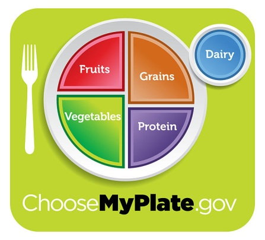

1.  Zapamti i ponovi 1. Korinćanima 6:19,20.

2.  Iseci slike i napravi kolaž da pokažeš pet osnovnih prehrambenih
    grupa. Aranžiraj slike kako bi pokazao tri zdrava obroka koje možeš
    da jedeš.

3.  Objasni zašto tvoje telo ima potrebu za vežbanjem.

4.  Tokom jedne sedmice beleži koliko sati si spavao. Objasni zašto je
    potreban odmor.

5.  Objasni zašto ti je potreban svež vazduh i sunčevo svetlo.

6.  Objasni zašto je voda važna za tvoje telo. Kaži koliko čaša vode
    trebaš svakog dana da popiješ.

7.  Opiši i primeni dobru dentalnu zuba.

8.  Nabroj tri stvari koje mogu da ti unište zdravlje.

**Pomoć:**

1.  Pričajte zajedno kao grupa ili kao porodica o principima u ovom
    tekstu

2.  Organizujte žurku isprobavanja hrane
    iz svake od pet prehrambenih grupa. Vežite oči poletarcima i neka
    pogode koju hranu mirišu, a zatim da okuse tu hranu. ILI neka
    Poletarci iseku slike iz starih časopisa i zalepe ih na hamer papir
    ili papirne tanjire i razgovaraju o tome šta čini balansirani obrok.

3.  Tvoje telo ima potrebu da vežba da bi održalo mišiće jakima, ojačalo
    tvoje srce, pojačalo kapacitet tvojih pluća i da bi te učinilo da
    izgledaš lepše i osećaš bolje. Napravite nekoliko vežbi za zabavu i
    zdravlje. „Kornjača i zec" je vežba trčanja u mestu. Prvo „trčite"
    50 koraka sporo kao kornjača, a zatim 50 koraka brže kao što bi zec
    trčao. Pnovite tri puta. Organizujte trku građevinskih kolica u
    kojoj bi jedno dete držalo za zglobove stopala drugo dete koje bi
    šetalo na rukama. Oboje idu napred, jedno na rukama, drugo na
    nogama. Nakon toga se zamene mesta.

4.  Kada spavaš tvoje celo telo se odmara, uključujući i tvoji mišići,
    srce i disanje. Tvoje telo koristi to vreme da se oporavi i popravi.

5.  Bez svežeg vazduha mi ne možemo da živimo. Duboko dišite i uživajte.
    Preko sunčeve svetlosti dobijamo vitamin D, koji pomaže da nastanu
    jake kosti. Sunčeva svetlost je dezinfektivno sredstvo. Vežbajte na
    sunčevom svetlu praveći „Ruski hop". Čučnite sa prekrštenim rukama
    na grudima. Skakućite krećući se napred u krug, a nakon svakog skoka
    vraćate se u početnu poziciju.

6.  Mi gubimo tečnost kada dišemo, mokrimo ili se znojimo i ona mora
    biti nadoknađena. Tvoje telo se sastoji otprilike od dve trećine ili
    65% vode. Treba da se pije dve i po litre vode dnevno da bi ostali
    zdravi. Mnoge hrane imaju vodu; kupus je sačinjen od devet desetina
    vode.

7.  Stomatolog ima obrazovne materijale koji objašnjavaju dentalnu
    higijenu deci.

8.  Kontaktirajte vašeg porodičnog lekara, lokalno zdravstveno odeljenje
    ili javnu biblioteku za video ili film koji mogu ovo da učine pravim
    poučnim doživljajem. Mnoge stvari mogu da ti unište zdravlje: manjak
    sna, loše navike u ishrani, malo ili nimalo vežbe, alkohol, duvan,
    droga,itd.
