1.  **Opiši ispravno korišćenje sledećih stvari:**

    a.  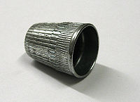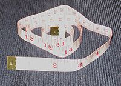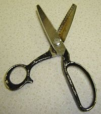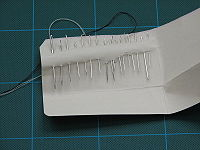**Naprstak** - zaštitni štit koji
        se nosi na prstu. Koristi se za guranje igle kroz deo platna u
        situacijama kada bi pritisak na iglu probio kožu. Naprstak se
        uglavnom pravi od metala, ali takođe može biti i od kože, gume,
        drveta, stakla ili porcelana.

    b.  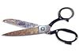**Metar traka** - Platnena
        plastificirana nerastegljiva traka koja se koristi za
        određivanje veličine odeće. Takođe se koristi za merenje platna.

    c.  **Makaze** - se koriste za sečenje platna.

    d.  **Cik cak makaze** - su makaze čije su oštrice nazubljene a ne
        ravne. Cik cak makaze ostavljaju cik cak trag umesto ravne
        ivice.\
        One su korisne za sečenje pletenog platna. Ivice platna koje
        nisu porubljene se lako iskrzaju, vez oslabi i niti se lako
        izvuku. Cik cak sečenje ne sprečava krzanje, ali ograničava
        dužinu iskrzanih niti i na taj način ograničava štetu.

    e.  **Razne vrste i veličine igli** - se koriste za probijanje
        platna i provlačenje niti kroz njih za svrhu pravljenja šava.
        Ovo može da se uradi ručno ili mašinski. Ručna igla ima rupicu u
        sebi (još zvano *uho*) pri kraju. Mašinska igla ima uho pri
        vrhu.

2.  **Upoznaj se sa mašinom za šivenje kod kuće ili negde drugde i
    prepoznaj seledeće delove:**

    a.  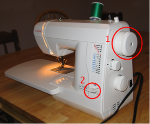**točak zamajca** (1) - pruža
        način ručnog pomeranja igle gore ili dole. On se koristi kako bi
        se igla podigla iz platna kada se šav završi, da bi se podiglao
        prihvatač gornjeg konca, ili kada je potrebno posebno pažljivo
        uraditi neki manji deo šava.

    b.  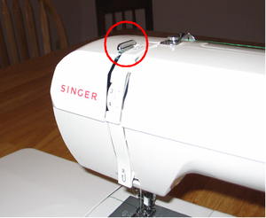**prihvatač gornjeg konca** - se pomera
        gore-dole sa iglom, održavajući tako konac zategnutim i po
        potrebi ga izvlačeći sa kalema.

    c.  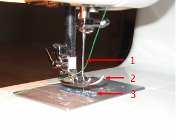**stopica** (2)- drži platno na
        mestu dok igla provlači konac kroz njega.

    d.  **zupci transportera tkanine** (3) -- su tanki metalni blago
        nazubljeni delovi ispod stopice. Dok se mašina za šivenje
        koristi, zupci transportera tkanine guraju tkaninu napred
        (odnosno unazad ukoliko se koristi poluga za šivenje unazad).
        Stopica drži platno blago pritisnuto na zupce transportera
        tkanine kako bi oni mogli da pomeraju tkaninu.

    e.  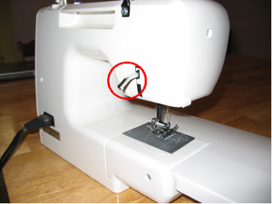**igla** (1) -- igla provlači konac kroz
        platno

    f.  **poluga za podizanje stopice** -- diže i spušta stopicu.
        Podigni je kada trebaš da postaviš platno ispod igle (i ispod
        stopice).

    g.  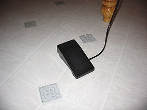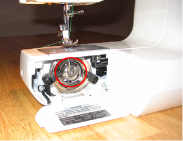**bobina** -- snabdeva drugi kalem konca.
        Između bobine i igle, dva konca se vezuju u čvorić i tako čine
        šav. Bobina može da se popuni koncem tako što se ona izvadi i
        stavi u mehanizam na vrhu ili sa strane mašine za šivenje.
        Uglavnom se popuni sa istim koncem koji se provlači kroz iglu.
        Konac bobine izlazi kroz rupu na ubodnoj ploči između zubaca
        transportera tkanine.

    h.  **papuča** -- je pedala koja je slična pedali za gas u autu.
        Kada se skroz pritisne, mašina za šivenje radi maksimalnom
        brzinom. Kada se blago pritisne, mašina radi sporije. Kada se
        otpusti, mašina za šivenje staje. Imajući papučicu koja se
        kontroliše nogom oslobađa obe ruke za vođenje platna kroz
        mašinu.

3.  **Pokaži kako se ispravno provlači konac kroz mašinu i kako se
    pokreće mašina**

    a.  Namotavanje Bobine\
        Prvo proveri da li bobina ima dovoljno konca boje koji ti je
        potreban za željeni posao. Ako nema, trebaćeš da namotaš bobinu.
        Prvo provuci nekoliko cm kroz rupu u bobini (ukoliko ima rupu).
        Zatim, postavi bobinu na malo vreteno koje se nalazi na vrhu ili
        sa strane mašine. Možda ćeš trebati da pomeriš vreteno ili
        polugu u odgovarajuću poziciju. Sa kalema uzmi konac, provuci
        kroz kukicu sa leve strane mašine i zatim ga namotaj nekoliko
        puta na bobinu. Nakon toga pažljivo pritisni papuču. Mašina bi
        trebala da namota konac na bobinu. Kada je bobina puna (ili ima
        dovoljno konca za ono što ti je potrebno), otpusti papuču, iseci
        konac i vrati bobinu naza u njeno mesto.

    b.  Provlačenje konca kroz mašinu\
        Kalem se postavlja na veliko vreteno na gornjem desnom delu
        mašine za šivenje. Odatle, konac putuje na levo na vodič gornjeg
        konca i okreće se ka tebi. Ono se zatim usmerava na dole u
        prosek u kućištu ili kod nekih modela kroz još jedan vodič konca
        pa na zatezač gornjeg konca. Odatle ono se okreće opet na gore,
        kroz prorez ili oko zatezača, do prihvatača gornjeg konca.
        Ponovo konac se okreće na dole dok ne dođe do iglenog vodiča
        gornjeg konca, nakon čega prolazi kroz iglene uši (korisno je
        oštrim makazama iseći kraj konca pre nego što se provuče kroz
        iglene uši).

    c.  Pokretanje mašine\
        Da bi pokrenuli mašinu, podigni stopicu i provuci komad platna
        ispod njega. Zatim spusti stopicu. Blago pritisni papuču dok
        vodiš platno kroz mašinu. Vežbaj korišćenje poluge za šivenje
        unazad kako bi dobio pravi šav. Kada se jednom uvežbaš biće ti
        veoma zanimljivo!

4.  **Porubi krpu ili neki drugi predmet praveći uredan i ujednačen šav\
    **Da bi napravio porub, najbolje je da prvo odeš do daske za
    peglanje. Presavij platno i ispeglaj presavijeni deo. Zatim ga opet
    presavij i opet ispeglaj taj deo. Ovo će osigurati opuštene krajeve
    platna u šav kako ne bi izašli pre nego što se zašiju.\
    Kada se porub ispegla, postavi taj deo na mašinu za šivenje sa šavom
    okrenutim na desnu stranu. Podigni stopicu i provuci platno ispod
    nje. Podesi iglu sprem platna u pravcu levo-desno tako da napravi
    šav na željenoj udaljenosti od ivize poruba. Takođe podesi iglu
    sprem platna u pravcu napred-nazad bi igla krenula oko cm od kraja
    platna. Nakon toga spusti stopicu. Drži pritisnutu ručicu za šivenje
    unazad i blago pritisni papuču. Čim šav dosegne zadnju ivicu platna,
    otpusti ručicu za šivenje unazad i mašina će krenuti da šije napred.
    Na ovaj način kada se prvo šije unazad osigurava se da se šav ne
    opara.\
    Pažljivo vodi platno kroz mašinu za šivenje, obraćajući pažnju na
    ivicu. Mašina za šivenje ima linije urezane na površini ubodne ploče
    kako bi se koristilo za držanje pravca. Pokušaj da vodiš platno
    koristeći jednu od ovih vodećih linija kako bi održao šav u stalnoj
    udaljenosti od ivice poruba. Ne moj da ideš prebrzo. Ako napraviš
    grešku, stani -- možda ćeš trebati da oparaš šav i kreneš iz
    početka. Bolje je ponovo početi nego samo nastaviti sa šivenjem!\
    Kako se šav približava drugom kraju poruba, uspori. Napravi šav
    skroz do kraja poruba a zatim čim stigneš dotle pritisni ručkicu za
    šivenje unazad. Pravi vez unazad jedan cm kako pričvrstio šav. Zatim
    stani. Koristi točak zamajca kako bi podigao iglu iz platna. Okreći
    točak dotle dok igla ne izađe iz platna i dok se konac od dole ne
    otpusti. Nakon toga podigni stopicu i izvadi platno. Odseci konac
    (treba da ima dva konca -- gornji i donji konac). Ali ostavi barem 8
    cm da izlazi iz iglenih ušiju. Inače, sledeći pokušaj šivenja bi
    lako mogao da izvuče konac iz igle.\
    Ukoliko ima nekih niti koje štrče iseci ih. Sada imaš pred sobom lep
    porub a mašina bi trebalo da je spremna da dalje šije.

5.  **Pokaži kako se ispravno prišiva dugme, driker, kukice i okca\
    **Prvi korak prišivanja dugmeta, drikera, kukice ili okca je da se
    pravilno nađe mesto za prišivanje. Ukoliko prišivate dugmad na staro
    mesto prvo pričvrstite ostalu dugmad. Zatim pogledaj gde su rupice
    od dugmeta koje nedostaje. Provuci konac kroz iglu, veži čvorić na
    kraj a zatim obeleži mesto dugmeta provlačeći iglu kroz platno iz
    unutrašnjosti ka spolja. Ukoliko ti odgovara sada možeš da raskopčaš
    drugu dugmad u tom nizu.\
    Provuci iglu kroz jednu od rupa kroz dugme od nazad ka napred. Zatim
    provuci je kroz susednu rupicu od napred. Zatim provuci iglu kroz
    platno blizu tačke gde je otpočeo vez. Zategni dugme povlačenjem
    konca ali pazi da ne bude previše zategnuto. dobro je da bude malo
    otpušteno dume da bi lakše moglo da se otkopčava i zakopčava.
    Idealno, dugme bi trebalo da je u mogućnosti da se povuče od platna
    3 mm. Isto ponovi još pet puta ili više kroz iste rupice. Zatim,
    ukoliko dugme ima 4 rupe isto učini iza druge dve rupe. Konačno,
    provuci iglu kroz platno blizu dugmeta ali je nemoj provući kroz
    rupu. Nekoliko puta koncem obavij spoj dugmeta sa platnom nakon čega
    provuci iglu kroz platno i veži čvorić. Pobrini se da koristiš čvrst
    konac za prišivanje dugmeta. Oni se dosta troše. Ukoliko se dugme
    dobro prišije sa jakim koncem, ono će čvrsto stajati na mestu tokom
    mnogo godina jake upotrebe.\
    Ukoliko prišivate drikere, kukice i okca, potrebno je da primenite
    iste principe kao i za prišivanje dugmeta. Prvo je bitno naći pravo
    mesto za prišivanje. Nakon toga prilikom svakog izlaska na stranu
    platna gde se prišiva driker, kukica ili okce, potrebno je provući
    kroz njihove rupice dotle dok ne stoji čvrsto a da se nije nakupilo
    previše konca. Završiti vezivanjem čvorića.

6.  **Objasni šta je rub, kosa linija, smer tkanine (poprečan, uzdužan i
    u koso).**

    a.  **rub** -- kod kupovnog platna je ivica dela platna posebno
        upletena da bude otporna na paranje.

    b.  **kosa linija** -- je linija koja ide od ugla do ugla kvadratnog
        dela platna. Kosa linija je veoma rastegljiva koja stoji na 45°
        stepeni sprem smera tkanine.

    c.  **smer tkanine** -- je unutrašnje polaganje tkanine -- što je
        način uplitanja niti od kojih je napravljena tkanina. Uzdužni
        smer je paralelan sa rubom a poprečni smer je normalan na rub.

7.  **Napravi vreću za prljavi veš za kampovanje ili neku sličnu
    jednostavnu stvar.**\
    Vreća za prljavi veš za kampovanje se lako pravi. Ono se uglavnom
    pravi od dva parčeta platna: krug i pravougaonik. Krug treba da je
    nekih 3cm veći u prečniku nego što je željena vreća. Širina
    pravougaonika bi trebala da je ista kao obim kruga (prečnik puta
    3,14). Dužina pravougaonika bi trebala da bude željena dužina vreće
    za veš plus 5 cm.\
    Kada se krug i pravougaonik iseku, zašij široki porub po širini
    pravougaonika. Zatim provuci kanap kroz porub ostavljajući oko 15cm
    kanapa sa obe strane.\
    Sledeći šav će napraviti tubu od pravougaonika. Ovaj šav bi trebao
    da se napravi dok je tuba izvrnuta, tako da se pobrini da je porub
    sa kanapom ispravno postavljen pre nego što kreneš sa šivenjem šava.
    Spoj dve ivice pravougaonika sa čiodama a zatim napravi šav po celoj
    dužini oko 1,5cm od ivice. Ovo bi trebalo da završi tubu. Kada je
    tuba zašivena, spoj dva kraja kanapa koristeći ribarski čvor ili
    neki sličan čvor za spajanje dva kanapa. Trebao bi da budeš u
    mogućnosti da povlačenjem kanapa stegneš otvor vreće za prljavi veš.
    Ova vreća će takođe moći da se nosi držeći kanap.\
    Sledeće, čiodama pričvrstite krug na krajeve tube sa druge strane od
    poruba sa kanapom. Nakon toga pažljivo prišijte krug za tubu. Kada
    je šav gotov, izvrnite vreću i pogledajte kako ste lepo napravili
    vreću.
