1.  **Objasni sledeće izraze:**

**Umetnost sa strunom:** Umetnost sa strunom je kada se pravi neki ručni
rad ili umetničko delo koristeći strune, konce ili kanape.

**Simografija:** Simografija je pravljenje trodimenzionalnih dizajnova
sa strunom bez štrikanja, vezenja ili pravljenja čvorova (osim za
nastavljanje kanapa).

**Geometrijsko šivenje:** Geometrijsko šivenje liči na Simografiju ali
umesto korišćenja eksera da drže strune na radnoj površini, koristi se
igla ili u napred izbušene rupe na površini kroz koje se provlače strune
i izvlače na kroz drugu rupu na površini. Postupak podseća na krpljenje
odeće.

2.  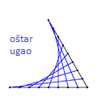**Nacrtaj na kartonu i na jednakim
    rastojanjima zašij:**

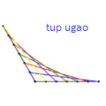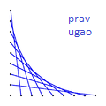

**a. Prav ugao b. Oštar ugao c. Tup ugao**

3.  **Navedi tri načina kako se priprema drvo za umetnost sa strunom.**

Postoji mnogo načina kako može da se pripremi drvo za umetnost sa
strunom:

-   Farba: Ona pokriva drvo i pridaje mu glatku površinu u boji po
    izboru.

-   Lazurni premaz: Lazur menja boju drveta dok u određenoj meri
    zadržava njegovu prirodnu teksturu. Tako tretirano drvo može da se
    izlakira kako bi izgledalo sjajnije.

-   Lak (čist): Štiti drvo a da mu ne menja boju. On pridaje drvetu
    sjaj.

-   Filc: Prekrij drvo filcom. Pričvrsti ga spajalicama ili *jednakim*
    slojem drvofiksa. Kapljice lepka bi se primetile, pa ako se odlučiš
    da koristiš lepak, moraš ga ravnomerno ispraviti, kao da slikaš s
    njim. Umereno rastegni filc preko drveta kako bi izbegao bore na
    njemu.

> Kada je drvo pripremljeno, umetnik treba da zakuca male eksere u tu
> drvenu ploču ali ne do kraja. Ovi ekseri su *vrhovi* oko kojih će se
> strune provlačiti. Kada se postavljaju ekseri, barem polovina eksera
> bi trebala da viri iznad drveta. Mora se voditi računa da se ekseri
> zakucaju dovoljno duboko tako da ne ispadnu usled zategnutosti strune.
> Projekat će izgledati mnogo lepše ukoliko su svi ekseri iste visine i
> ukoliko su vertikalno varalelni.
>
> Ukoliko imaš poteškoća da zabijaš eksere (teže je raditi kada imaš
> velike prste a male nokte!) pokušaj držati eksere sa parom šicastih
> klešta.
>
> Dobra ideja je da se šablon prvo iscrta na papiru. Zatim se sa
> lepljivom trakom zalepi papir na drvo i kroz njega zakucaju ekseri.
> Kada su ekseri zakucani, papir treba da se ukloni. Možda ti je
> iskušenje da ostaviš papir na drvetu kako bi lakše video kuda da
> provlačiš strunu, ali odoli tom iskušenju. Skoro je nemoguće ukloniti
> papir a da se ne ukloni barem neki deo strune. Zaista ti je mnogo
> lakše da ga ukloniš *pre* nego što provučeš strunu.
>
> Za početak, zaveži prvu strunu na prvi ekser. Pre nego što počneš da
> provlačiš strunu, jače je povuci kako bi isprobao da li je dobro
> pričvršćena za ekser i da li je taj ekser dobro zakucan u ploču.
> Ukoliko struna ili ekser ispadnu, bolje je to sada da se desi nego
> kasnije kada već veći deo posla bude gotov, što bi u tom slučaju
> učinilo spašavanje projekta veoma teškim.
>
> Osim korišćenja drveta za podlogu, postoje i druge vrste podloga.
> Jedan od tih načina je korišćenje stiropora ili stirodura debljine oko
> 2cm, preko kojeg se stavi tanji (0,5-2cm) list tamnije ploče
> termoizolacionog materijala nalik stiroporu koji je čvršći od
> stiropora. Ukoliko nije moguće nabaviti u crnoj, sivoj ili nekoj
> tamnijoj boji, onda može da se ofarba crnom farbom za beton. Ukoliko
> se podloga tako pravi iz dva sloja onda se oni trebaju zalepiti nekim
> lepilom koje ne nagriza stiropor. Uz ovakvu podlogu ne morate da
> koristite eksere, nego jednostavne čiode, što može da bude mnogo lakše
> i brže za pripremu a i da pridaje lepši izgled.

4.  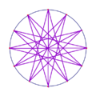**Koristi metodu veza na drvetu napravi četiri od
    sledećih oblika:**

    a.  **Ispunjen krug**

> 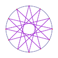U „ispunjenom krugu" struna prelazi
> preko centralnog dela kruga, tako da nema praznog prostora u sredini
> kruga.

b.  **Šuplji krug**

> U „šupljem" krugu, struna ne prolazi kroz centralni deo kruga, tako da
> nema strune u sredini kruga.

c.  **Zvezda**

> Dizajn koji se odlikuje po kracima nalik zvezdi

d.  **Ivičenje**

> 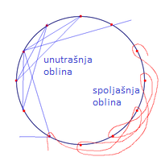Ocrtavanje ivica time što se u par
> navrata ide napred nazad po ivici.

e.  **Unutrašnja oblina**

> Ovo je jedan od načina za ivičenje s tim da niti prelaze i preko
> unutrašnjeg dela kruga.

f.  **Spoljašnja oblina**

> Ovo je jedan od načina za ivičenje s tim da niti ne prelaze ivicu
> kruga na unutra.
>
> 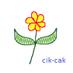

g.  **Ispunjavanje**

> Ispunjavanje se može praviti ili u cik-cak stilu ili nalik
> povezivanjem slučajnih naspramnih eksera.

h.  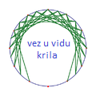**Vez u vidu krila**

> Pravi se kao krug koristeći unutrašnje obline s time da se sa obe
> strane ne dovrši u potpunosti.

5.  **Koristeći neke od ovih metoda napravi jedno originalno umetničko
    delo na drvetu koje ćeš negde okačiti.**

Za dalje istraživanje:\
Na Google-u ili Youtube-u možete potražiti: „String art" ili „String art
patterns" za mnogo dobrih ideja.

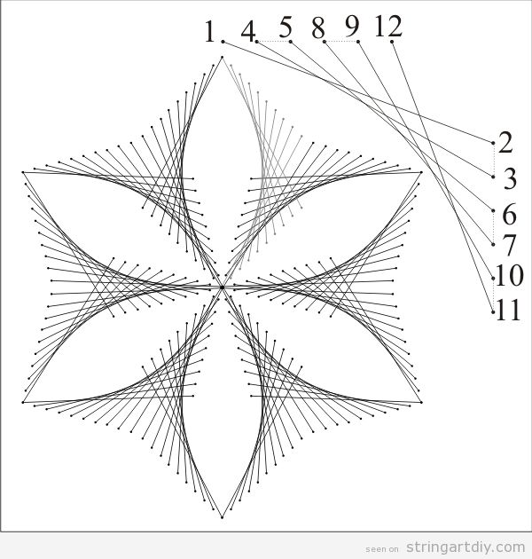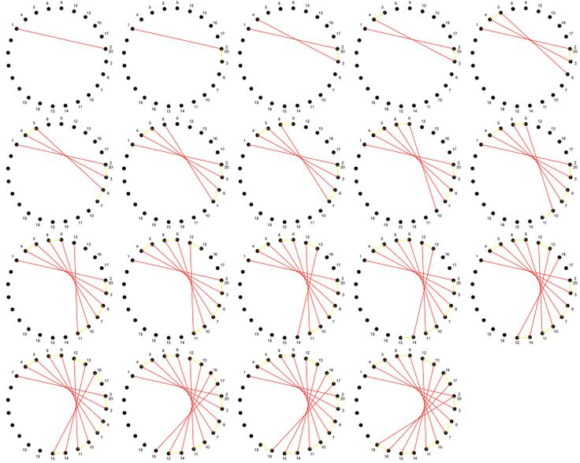Ideje za dizajne:

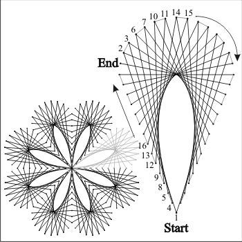

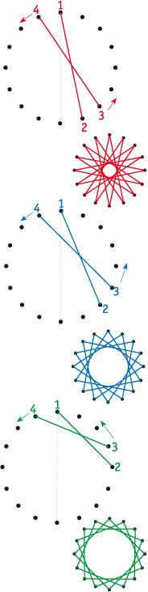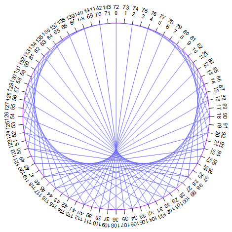

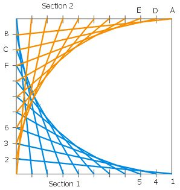

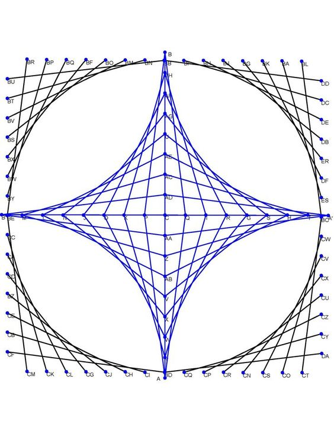

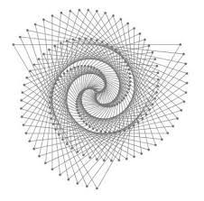
