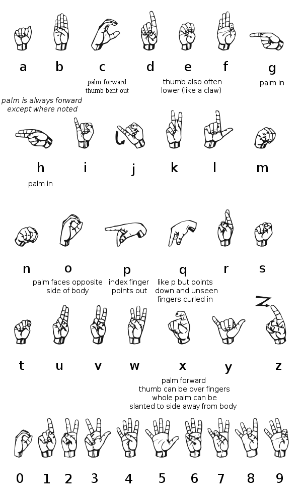

1.  ***Nauči abecedu znakovnog jezika gluvih i osoba sa oštećenim
    sluhom.***

Američka 'ručna' tj. znakovna abeceda je abeceda koja se koristi za
spelovanje reči u Američkom znakovnom jeziku kada je to neophodno (za
imena, nazive). Dlan je skoro uvek okrenut posmatraču, tj osobi sa kojom
razgovarate.

Možeš da vežbaš čitanje znakovne abecede
ovde http://asl.ms/ i ovde
 http://www.aslpro.com/cgi-bin/aslpro/fingerspell.cgi

Ima varijacija u različitim jezicima ali ovo je osnova za znakovnu
abecedu u: Paragvaju, Filipinima, Tajlandu, Maleziji, Hong Kongu,
Tajvanu, Singapuru, Nemačkoj, Austriji, Norveškoj i Finskoj. Potiče od
stare Španske znakovne abecede koja je nastala u 17. veku.

**Pravilno spelovanje**

-   Ruka bi trebala da ostane na istom mestu dok speluješ, ili češće, da
    se blago pomera, kao da se ispisuje tekst u vazduhu (taj pokret
    nesme da se prenaglašuje).

-   Ako se speluje više reči ili čitave rečenice znakovnom abecedom,
    treba da postoji kratka pauza između reči ili da se ruka suptilno
    pomeri malo niže, kao da se prebacuje u novi red.

-   Dugi i šareni nokti, kao i puno nakita, mogu da odvraćaju pažnju
    onog koji čita, tako da oni koji konstantno komuniciraju znakovnim
    jezikom izbegavaju ovo.

-   Kada se speluju akronimi u ASL-u (ASL, FBI, NASA, RID (Registar
    prevodioca za gluve)), slova se pomeraju u malim krugovima kako bi
    se izbeglo da se slova čitaju kao reč.

-   Kada koristite znakovnu abecedu, ruka nesme da se puno pomera zato
    što je to jako teško pratiti i čitati. Važno je pomeriti ruku kada
    se pokazuje duplo slovo, prelazi na sledeću reč, ali obično ruka
    nesme da poskakuje, šeta, da se trese ili se pomera na bilo koji
    način koji bi ometao posmatrača. Ova navika obično može da se
    prevaziđe posle par sati vežbe.

-   Pazite na oblik slova više nego na brzinu.

-   U svakodnevnom govoru, prvo slovo se drži malo duže da bi onaj sa
    kim pričate registrovao da spelujete.

**Česte greške**

Ljudi koji uče znakovnu abecedu često greše zbog nepravilnog razumevanja
grafika. Zato je važno da se provede vreme sa instruktorom.

**Slova**

Neka slova su okrenuta na grafiku radi boljeg prikaza, ali kod svih
slova dlan je okrenut prema osobi sa kojom razgovarate, osim kod slova g
i h gde je dlan okrenut prema osobi koja speluje.

**Brojevi**

Kod brojeva 1-5 dlan je okrenut prema osobi koja govori, dok je dlan kod
brojeva 6-9 okrenut prema osobi kojoj se govori. Nula izgleda kao slovo
O.

2.  ***Provedi makar tri sata učeći znakovni jezik sa instruktorom.***

Najbolje bi bilo kada bi instructor mogao da dođe u vaš odred ili da svi
zajedno odete na tri časa obuke znakovnog jezika.

3.  ***Nauči da čitaš i pišeš abecedom znakovnog jezika brzinom od pet
    reči u minuti (tj. 25 slova u minuti).***

4.  ***Nauči makar 100 znakova iz jedne od navedenih knjiga i
    rečnika.***

**A Basic Course in Manual Communication**, T.J. O\'Rourke, National
Association of the Deaf, 814 Thayer Avenue, Silver Spring, MD 20901.

**Ameslan, An Introduction to American Sign Language**, Louie Fant, Jr.,
Joyce Media, P.O. Box 458, Northridge, CA 91328. Play It By Sign, Ibid.
(Joyce Media also has instructional films.)

**Joy of Signing**, Lottie, L. Riekehof, Gospel Publishing House,
Springfield, MO.

**Talk to the Deaf**, Etc., Gallaudet College Press, Washington, D. C.
20002.

**Expressive and Receptive Fingerspelling for Hearing Adults**, La Vera
M. Guillory, Claitor\'s Publishing Division, P.O. Box 3333, Baton Rouge,
LA 70821.

**An Introduction to Manual English**, The Washington State School for
the Deaf, Vancouver, WA 98661.

Ako ne možete da nađete neku od ovih knjiga nađite nešto slično.

[**http://www.aslpro.com**](http://www.aslpro.com/), Sadrži tri ASL
recnika i različita pomoćna sredstva.

[**http://www.lifeprint.com**](http://www.lifeprint.com/), Najbolji
izvor za učenje ASL znakova.

5.  ***Nauči i pokaži na znakovnom jeziku barem dve jednostavne
    pesme.***

Isus me voli

Rejoice in the Lord, Always

Neka pesma po tvom izboru (na youtubu možeš naći razne pesme na
znakovnom jeziku)

6.  ***Uradi jedno od sledećeg:***

```{=html}
<!-- -->
```
a)  Objasni razliku između Američkog znakovnog jezika i znakovnog
    Engleskog i demonstriraj upotrebu oba.

> ASL ima malo veze sa gramatikom i ne prati se red reči u rečenici već
> je baziran na konceptu. Znakovni Engleski prati redosled reči i
> potpuno je vezan za gramatiku. Napravljen je da bi se što vernije
> preneo Engleski jezik, dok se ASL koristi zbog efikasnosti i
> praktičnosti.

b)  Pročitaj i pričaj ili napiši sastav o nekoj školi u tvojoj zemlji
    koja se bavi edukacijom gluvih ili osoba sa oštećenim sluhom.
