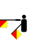
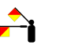
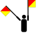
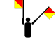
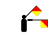
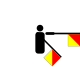

**Morzeova azbuka** je metoda prenošenja
informacije, koristeći standardizovane nizove kratkih i dugih oznaka ili
pulsova -- poznatijim kao "tačkama" i "crtama" - za slova, brojeve i
znakove interpukcije. Prvobitno napravljen za električni telegraf
Samuela Morzea sredinom 1830-ih, takođe je bio naširoko korišten za ranu
radio komunikaciju početkom 1890-ih. Ipak, sa razvojem naprednijih
komunikacionih tehnologija, rasprostranjeno korišćenje Morzeovog koda je
sada veoma zastarelo, osim korišćenja u hitnim slučajevima i drugih
specijalizovanih primena, uključujući navigacione radio odašiljače, i
radio amatere. Morzeova azbuka je jedini napravljeni digitalno
modulisani modalitet koji mogu ljudi da čitaju bez kompjutera, čineći ga
odgovarajućim za slanje automatizovanih digitalnih podataka u glasovnim
kanalima, kao i čineći ga idealnim za signaliziranje u hitnim
slučajevima, tako što se improvizovani izvori energije mogu lako
koristiti za signalizaciju uključivanjem i isključivanjem.

Morzeova azbuka može da se prenosi na više načina: originalno kao
električni pulsevi duž telegrafske žice, ali i kao zvučni tonovi, kao
radio signal sa kratkim i dugim pulsevima ili tonovima, ili kao
mehanički ili vizualni signal (npr. trepćuće svetlo). Zato što se
morzeova azbuka prenosi koristeći samo dva stanja -- uključeno i
isključeno -- to je bio rani oblik digitalnog koda. Internacionalna
morzeova azbuka je sastavljena od šest elemenata:

  -----------------------------------------------------------------------------
  **Element**     **Opis**               **Pevanje**             **Trajanje**
  --------------- ---------------------- ----------------------- --------------
  Kratki znak     Tačka ( . )            "TI" (na kraju          1
                                         morzeovog znaka "TIT")  

  Dugi znak       Crta ( - )             "TAA"                   3

  Među-signalna   Između tačaka i crta                           1
  pauza           unutar jednog znaka                            

  Kratka pauza    Između znakova                                 3 \*

  Srednja pauza   Između reči                                    5 \*

  Dugačka pauza   Između rečenica                                7 \*
  -----------------------------------------------------------------------------

\* za početnike (koji mogu da pošalju do 10 reči u minuti) dužina
kratke, srednje i dugačke pauze može da se odredi da bude duplo duža

Oni koji uče Morzeovu azbuku se često
podučavaju da razumeju slova i druge simbole u njihovoj punoj ciljnoj
brzini, odnosno sa njihovim normalnim relativnim trajanjem tačaka, crta
i pauza unutar svakog simbola za tu brzinu. Produžene pauze između
simbola i reči se koriste da se da "vreme za razmišljanje", koje može
vremenom da se skrati sa vežbanjem i navikavanjem. To čini da se
"oblici" zvukova lakše nauče. Ovaj metod učenja se zove **Farnsvortov
metod**. Drugi popularni način učenja je **Kohov metod**, koji koristi
punu ciljnu brzinu od samog početka, ali započinje sa samo dva znaka.
Kada se nizovi ta dva znaka mogu naučiti sa 90% tačnošću, dodatni znak
se dodaje, i tako dalje dok se ceo skup znakova ne usavrši.

  -----------------------------------------------------------------------
  slovo (latinica)    kod            izgovor       izgovor (engleski)
  ------------------- -------------- ------------- ----------------------
  A                   **. -**        Avala         Alpha

  B                   **- . . .**    Beograd       Bravo

  C                   **- . - .**    Cetinje       Charlie

  D                   **- . .**      Drina         Delta

  E                   **.**          Evropa        Echo

  F                   **. . - .**    Futog         Foxtrot

  G                   **- - .**      Golija        Golf

  H                   **. . . .**    Heroj         Hotel

  I                   **. .**        Igalo         India

  J                   **. - - -**    Jadran        Julliet

  K                   **- . -**      Kosovo        Kilo

  L                   **. - . .**    Lovćen        Lima

  M                   **- -**        Morava        Mike

  N                   **- .**        Niš           November

  O                   **- - -**      Obilić        Oscar

  P                   **. - - .**    Pirot         Papa

  Q                   **- - . -**    Kvorum        Quebec

  R                   **. - .**      Ruma          Romeo

  S                   **. . .**      Sava          Sierra

  T                   **-**          Timok         Tango

  U                   **. . -**      Užice         Uniform

  V                   **. . . -**    Valjevo       Victor

  W                   **. - -**      Duplo ve      Whiskey

  X                   **- . . -**    Ksilofon      X-Ray

  Y                   **- . - -**    Ipsilon       Yankee

  Z                   **- - . .**    Zemun         Zulu

  1                   **. - - - -**  Jedinica      One

  2                   **. . - - -**  Dva           Two

  3                   **. . . - -**  Tri           Three

  4                   **. . . . -**  Četiri        Four

  5                   **. . . . .**  Petica        Five

  6                   **- . . . .**  Šest          Six

  7                   **- - . . .**  Sedam         Seven

  8                   **- - - . .**  Osam          Eight

  9                   **- - - - .**  Devet         Nine

  0                   **- - - - -**  Nula          Zero
  -----------------------------------------------------------------------

Noviji sistem **semafor** zastavica
koristi dva kratka štapa sa kvadratnim zastavicama, koje zastavnik drži
u različitim pozicijama da signalizira slova alfabeta i brojeve.
Zastavnik drži štap u svakoj ruci i pruža svaku ruku u jednom od osam
mogućih pravaca. Osim u položaju za pauzu, zastavice ne smeju da se
preklapaju. Zastavice se farbaju drugačije zavisno od tog da li se
signalizira na moru ili na kopnu. Na moru, zastavice su ofarbane crveno
i žuto, a na kopnu, crveno i belo.

Naredni semafor znakovi su predstavljeni tako kao kada bi bili okrenuti
ka zastavniku (drugim rečima, pravite se da vidite lice zastavnika).
Slova skoro da prate savršeni pravilni niz. J, V i Y prekidaju taj niz.
Mi ih ovde predstavljamo u alfabetnom redosledu, a onda posle po
položaju u seriji krugova.

**Alfabetni redosled**

  ----------------------------------------------------------------------------------------------------------------------------------------------------------------------------------------------------------------------------------------------------------------------------------------------------------------------------------------------------------------------------
  Čekanje i pauza                            height="0.6980314960629921in"}Brojevi                                    height="0.6980314960629921in"}Pažnja                                     height="0.6980314960629921in"}Brisanje                                   height="0.6980314960629921in"}A / 1
  ------------------------------------------------------------------------ ------------------------------------------------------------------------ ------------------------------------------------------------------------ ------------------------------------------------------------------------ ------------------------------------------------------------------------
  B / 2                                      height="0.6980314960629921in"}C / 3                                      height="0.6980314960629921in"}D / 4                                      height="0.6980314960629921in"}E / 5                                      height="0.6980314960629921in"}F / 6

  G / 7                                      height="0.6980314960629921in"}H / 8                                      height="0.6980314960629921in"}I / 9                                      height="0.6980314960629921in"}J / Slova                                  height="0.6980314960629921in"}K / 0

  L                                          height="0.6980314960629921in"}M                                          height="0.6980314960629921in"}N                                          height="0.6980314960629921in"}O                                          height="0.6980314960629921in"}P

  Q                                          height="0.6980314960629921in"}R                                          height="0.6980314960629921in"}S                                          height="0.6980314960629921in"}T                                          height="0.6980314960629921in"}U

  V                                          height="0.6980314960629921in"}W                                          height="0.6980314960629921in"}X                                          height="0.6980314960629921in"}Y                                          height="0.6980314960629921in"}Z
  ----------------------------------------------------------------------------------------------------------------------------------------------------------------------------------------------------------------------------------------------------------------------------------------------------------------------------------------------------------------------------

**Po položaju**

  -----------------------------------------------------------------------------------------------------------------------------------------------------------------------------------------------------------------------------------------------------------------------------------------------------------------------------------------------------------------------------------------------------------------------------------------------------------------------------------------------------------------------------------------------------------
  A / 1                                     height="0.6980314960629921in"}B / 2                                      height="0.6980314960629921in"}C / 3                                      height="0.6980314960629921in"}D / 4                                      height="0.6980314960629921in"}E / 5                                      height="0.6980314960629921in"}F / 6                                      height="0.6979166666666666in"}G / 7
  ----------------------------------------------------------------------- ------------------------------------------------------------------------ ------------------------------------------------------------------------ ------------------------------------------------------------------------ ------------------------------------------------------------------------ ------------------------------------------------------------------------ ------------------------------------------------------------------------------------------------------
                                                                          H / 8                                      height="0.6980314960629921in"}I / 9                                      height="0.6980314960629921in"}K / 0                                      height="0.6980314960629921in"}L                                          height="0.6980314960629921in"}M                                          

                                                                                                                                                   S
                                                                                                                                                   height="0.6980314960629921in"}O                                          height="0.6980314960629921in"}P                                          height="0.6980314960629921in"}Q                                          height="0.6980314960629921in"}R                                          

                                                                                                                                                                                                                            T                                          height="0.6980314960629921in"}U                                          height="0.6980314960629921in"}Y                                          height="0.6980314960629921in"}Brisanje

                                                                                                                                                                                                                                                                                                     V
                                                                                                                                                                                                                                                                                                     height="0.6980314960629921in"}Brojevi                                    height="0.6980314960629921in"}J / Brojevi                                

                                                                                                                                                                                                                                                                                                                                                                              X
                                                                                                                                                                                                                                                                                                                                                                              height="0.6980314960629921in"}W                                          

                                                                                                                                                                                                                                                                                                                                                                                                                                                       Z
  -----------------------------------------------------------------------------------------------------------------------------------------------------------------------------------------------------------------------------------------------------------------------------------------------------------------------------------------------------------------------------------------------------------------------------------------------------------------------------------------------------------------------------------------------------------

Da bi slali Morzeovu azbuku zastavicama, očigledno je da se prvo treba
znati Morzeova azbuka. Drugo, treba da se zna da se šalju tačke i crte
zastavicama. Pošiljalac drži dve zastave, po jednu u svakoj ruci.
Pozicija za pauzu je obe zastavice uspravno. Da bi se poslala tačka,
zastavica na desnoj strani je spuštena na desno i ponovo podignuta. Da
bi se poslala tačka, leva zastavica je spuštena lefo i ponovo podignuta.

**Uslovi za polaganje veštarstva "Komunikacije":**

***Za prvi nivo veštarstva** potrebno je ispuniti jedan od sledećih
zahteva**:***

a.  ## Internacionalnom Morzeovom Azbukom pošalji i primi poruku brzinom od tri reči u minuti koristeći baterijsku lampu, zviždaljku, ogledalo, zujalicu ili ključ. (petoslovne reči, minimum dvadeset reči)

b.  ## Pošalji i primi semaforskim kodom brzinom sedam reči u minuti koristeći semaforske zastavice. (petoslovne reči, minimum 20 reči)

c.  ##  Pošalji i primi internacionalnom Morzeovom azbukom brzinom tri reči u minuti koristeći zastavice. (petoslovne reči, minimum 20 reči.)

***Za drugi (napredni) nivo veštarstva** potrebno je imati položen prvi
nivo veštarstva "Komunikacije" i ispuniti jedan od sledećih
zahteva**:***

a.  ## Internacionalnom Morzeovom Azbukom pošalji i primi poruku brzinom od osam reči u minuti koristeći baterijsku lampu, zviždaljku, ogledalo, zujalicu ili ključ. (petoslovne reči, minimum dvadeset reči)

b.  ## Pošalji i primi semaforskim kodom brzinom 12 reči u minuti koristeći semaforske zastavice. (petoslovne reči, minimum 20 reči)

c.  ##  Pošalji i primi internacionalnom Morzeovom azbukom brzinom osam reči u minuti koristeći zastavice. (petoslovne reči, minimum 20 reči.)

Udžbenik pripremio Hrišćanski Izviđački Savez, godine 2010.

Uslovi za sticanje veštarstva "Komunikacije" važe isključivo uz
prisutnost osoba za to određene od strane Hrišćanskog Izviđačkog Saveza,
uz poštovanje propisa za polaganje veština i veštarstava napisanih u
statutu Hrišćanskog Izviđačkog Saveza.
