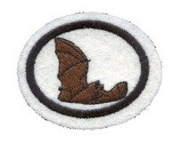

# ŠIŠMIŠI 

1\. Zašto šišmiši pripadaju sisarima a ne pticama?

Ovde su prikazani načini identifikacije za sisare, ptice I šišmiše.
Nakon upoređivanja ovih parametara jasno je koliko su šišmiši slični
sisarima.

**Sisari:**

-   **Krzno**

-   **Donose na svet žive mladunce (izuzev kljunara)**

-   **Mladunci sisaju mleko**

-   **Toplokrvni su**

-   **Četiri noge sa prstima i/ili "rukama" I "nogama"**

**Šišmiši:**

-   **Imaju krzno ili dlaku**

-   **Mladunci su rođeni živi**

-   **Mladunci sisaju mleko**

-   **Toplokrvni su**

-   **Šišmiši imaju ruke, šake i noge**

**Ptice:**

-   **Imaju perje**

-   **Izležu se iz jajeta**

-   **Ženke mladunce hrane iz svojih usta**

-   **Imaju krila**

2\. Koja je glavna karakteristika koja odvaja šišmiše od drugih sisara?

Šišmiši su jedini sisari koji zaista lete. Ostale vrste kao što su
leteće veverice koriste silazne putanje vetra i iako se čini da lete one
u stvari lebde.

3\. Koje je ime reda kojem pripadaju šišmiši i šta to predstavlja?

Šišmiši su klasifikovani u red Chiroptera, koji doslovno na latinskom
znači "ruka-krilo" . Ovakav naziv je i logičan jer se krila šišmiša
protežu preko cele ruke sve do prstiju, a takođe su spojena sa nožnim
gležnjem. Samo ime reda potiče iz grčkog jezika, Cheir=ruka;
Pteron=krilo. Ovakav naziv su dobili nakon naučnih opservacija da
šišmiši lete pokretima njihovih modifikovanih ruku.

4\. Koji su najveći a koji najmanji šišmiši? Gde im je stanište?

-   **Najveći:** Najveći leteći sisari su Leteće lisice, posebno one
    > koje žive u Aziji I Australiji. Neke vrste imaju dužinu od 45 cm,
    > raspon krila od 1.7 m i težinu od 1.6 kg. Indijska Leteća lisica
    > je posebno značajna jer njen raspon krila može doseći do 183 cm.

-   **Najmanji:** Najmanji šišmiš na svetu je Kitti\'s Hog-Nosed Bat
    > (poznatiji kao šišmiš bumbar) sa Tajlanda. Teži malo manje od
    > kovanice od jednog penija I rasponom krila manjim od 12 cm, ovo je
    > ujedno I najmanji sisar na svetu.

5\. Koliko ima vrsta šišmiša?

Otprilike postoji 1000 vrsta šišmiša, sa staništem na svim kontinentima
osim Antarktika. Pronađeno je oko 825 vrsta Micro-chiroptera, i
otprilike 175 vrsta Mega-chiroptera.

6\. Šišmiši su podeljeni u dva podreda. Koja su njihova imena?

**a. Mega-chiroptera**

**b. Micro-chiroptera**

7\. Koji podred šišmiša koristi eholokaciju a koji se služi vidom da
pronađe hranu?

-   **a. Megabats:** Koriste vid.

```{=html}
<!-- -->
```
-   **b. Microbats:** Koriste eholokaciju. (Šišmiši šalju zvučne talase
    > koristeći usta ili nos. Kada ovaj zvučni talas dođe do nekog
    > objekta eho se vraća do šišmiša. Tada ovaj sisar može
    > identifikovati objekt na osnovu zvuka koji eho proizvodi. Na ovaj
    > način mogu utvrditi veličinu, oblik I teksturu nekog nalog
    > insekta. Većina šišmiša koristi eholokaciju da bi se orjentisali u
    > mraku ili da pronađu hranu.)

8\. Šta je glavna namirnica u ishrani Megašišmiša?

Megašišmiši se nazivaju I voćni šišmiši zbog toga što jedu voće, nektar
I polen.

9\. Šta je glavna namirnica u ishrani Mikrošišmiša?

Mikrošišmiši generalno jedu insekte iako imaju mnogo raznovrsniju
ishranu od megašišmiša. Pored insekata mikrošišmiši jedu sve sa nektarom
I voće kao I megašišmiši, zatim ribu, manje sisare I ptice, pa čak I
krv.

10\. Koliko mladunaca se rodi svake godine? Kako se zovu mladunci
šišmiša?

Većina šišmiša donese na svet jedno mladunče godišnje. Moguće su
višestruke trudnoće tako da se rađaju blizanci I trojke. Mladunci se
nazivaju štenci.

11\. Pronađi tri biblijska teksta koji pominju šišmiše?

**3. Mojsijeva 11:19:** I roda I čaplja po svojim vrstama, I pupavac I
ljiljak. (Ljiljak je šišmiš.)

**5. Mojsijeva 14:18:** Ni rode, ni čaplje po vrstama njezinim, ni
pupavca ni ljiljka.

**Isaija 2:20:** Tada će baciti čovek idole svoje srebrne I idole svoje
zlatne, koje načini sebi da im se klanja, krticama I slepim mišima.

**Koji proročki biblijski tekst o kraju vremena pominje šišmiše?**

**Isaija 2:20:** Tada će baciti čovek idole svoje srebrne I idole svoje
zlatne, koje načini sebi da im se klanja, krticama I slepim mišima**.**

12\. Da li šišmiši ulaze u hibernaciju ili migriraju kad dođe zima?

U hladnijim klimatskim podnebljima šišmiši ili ulaze u stanje
hibernacije ili migriraju u toplije predele. Šišmiši koji nastanjuju
tropska područja aktivni su tokom cele godine.

13\. Nacrtaj i objasni delove jednog šišmiša?

Delovi tela šišmiša su: koleno, membrane repa, rep, kalkal, noga,
membrane krila, prsti, zglob, uho, tragus, palac, podlaktica.

Kalkal je tetiva koja povezuje nogu sa repom.\
Tragus je deo tela koji šišmiši imaju kao I ljudi. To je hrskavica na
samom ulazu u ušni kanal.


14\. Koliko insekata može šišmiš pojesti za sat vremena?

600 - 1,000 insekata po satu na osnovu njihove telesne težine. Jedan
braon šišmiš može pojesti I 1200 insekata za sat vremena.

15\. Koje dve glavne koristi ljudi imaju od šišmiša?

-   **a. Jedu insekte.** Jedan braon šišmiš može pojesti I do 1200
    > insekata za sat vremena (3,000 - 7,000 za jednu noć).Šišmiši se
    > hrane insektima štetočinama kao što su bubašvabe, komarci.. Velike
    > kolonije šišmiša mogu pojesti mnoštvo insekata koje bi inače
    > naštetile usevima.

```{=html}
<!-- -->
```
-   **b. Oprašuju biljke I nose seme.** Jedna od uloga je I da su često
    > oprašivači biljaka koje ljudi koriste za ishranu.

```{=html}
<!-- -->
```
-   **c. Obezbeđuju mogućnost za medicinska istraživanja.** Eholokacija
    > kojom se koriste se proučava u svrhu pomoći medicinskog osoblja
    > slepima. Hemijske supstance koje se nalaze u pljuvački vampirskog
    > šišmiša (Draculin) testiraju se kao prevencija prilikom srčanog I
    > moždanog udara.

16\. Napravi ili kupi kutiju za šišmiše. Raspitaj se koje je pravo mesto
za njeno postavljanje i učini to (kod kuće, u školi ili crkvi).
Posmatraj ponašanje šišmiša (koja vrsta I koliko njih koristi kutiju).


