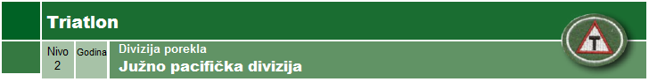

**Uslovi**

1.  Iznesi tri biblijska principa I dva principa iz Duha Proroštva koji
    podržavaju rekreaciju.

2.  Napiši izveštaj o ispravnoj ishrani kako bi ostvario najbolju
    fizičku spremnost I kako se ona održava tokom treninga. Uključi i
    unos tečnosti za vreme I pre takmičenja, I unos hrane za vreme
    takmičenja.

3.  Uradi sledeće:

    a.  Iznesi smernice za ispravan trening, uključujući zagrevanje,
        istezanje, sprečavanje povreda, sprečavanje preterivanja u
        treningu, itd.

    b.  Pokaži svoj redovni program treninga

    c.  Nabroj ispravnu opremu, uključujući bicikl, obuću I odeću

4.  Pokaži znanje tehnika plivanja, vožnje bicikla I trčanja.

5.  Učestvuj u sva tri aspekta prepoznatog triatlonskog događaja,
    samostalno ili kao član tima gde je triathlon sličan:

    a.  Plivanje -- 500m

    b.  Bicikl -- 15km

    c.  Trčanje -- 10km

    d.  Za 4 sata I 30 minuta

> (Sprint triatloni se održavaju svake godine u našoj zemlji: Plivanje
> 750m, bicikl 20km, trčanje 5km)
