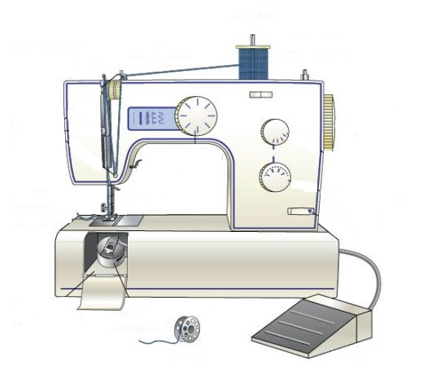

Ime i prezime:

1.  Opiši ispravno korišćenje sledećih stvari:

    a.  Naprstak

    b.  Metar traka

    c.  Makaze

    d.  Cik cak makaze

    e.  Razne vrste i veličine igli

2.  Upoznaj se sa mašinom za šivenje kod kuće ili negde drugde i
    > prepoznaj seledeće delove:

    a.  točak zamajca

    b.  prihvatač gornjeg konca

    c.  stopica

    d.  poluga za podizanje\
        > stopice

    e.  igla

    f.  zupci transportera\
        > tkanine

    g.  bobina

    h.  papuča

3.  Pokaži kako se ispravno provlači konac kroz mašinu i kako se pokreće
    > mašina

4.  Porubi krpu ili neki drugi predmet praveći uredan i ujednačen vez

5.  Pokaži kako se ispravno prišiva dugme, driker, kukice i okca

6.  Objasni šta je:

    a.  rub

    b.  kosa linija

    c.  smer tkanine (poprečan, uzdužan i u koso).

7.  Napravi vreću za prljavi veš za kampovanje ili neku sličnu
    > jednostavnu stvar.
