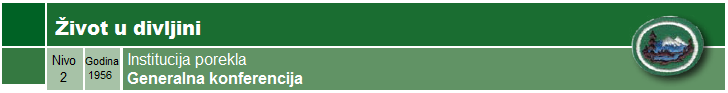

**USLOVI**

1.  Idi na barem dva vikend kampovanja na kojima ćeš naučiti sposobnosti
    potrebne za ovu veštinu.

2.  Kojih su pet stvari koje trebaju da se urade ukoliko se izgubi u
    divljini. Pokaži znanje tri metoda određivanja pravaca sveta bez
    kompasa.

3.  Pokaži tri načina da se pročisti voda za piće.

4.  Koja su tri načina da se sakupi pijaća voda u divljini i pokaži dva
    od tih metoda.

5.  Pokaži dva metoda procenjivanja visine drvena i širine potoka.

6.  Prepoznaj četir divlje životinje ili ptice po njihovim tragovima.

7.  Koristeći kompas ili busolu, prati stazu dužu od 100m sa tri
    različita pravca i manje od 5% greške.

8.  Prepoznaj u divljini, pripremi i pojedi 10 vrsta divljeg bilja.

9.  Imaj lični komplet za preživljavanje sa 15 stvari i znaj kako da
    koristiš svaku od njih.

10. Objasni zašto je u divljini neophodan dobar san, odgovarajuća
    ishrana, lična higijena i odgovarajuće vežbe.

11. Imaj položenu veštinu "Prva pomoć". Osim veštine "Prva pomoć",
    pokaži znanje sprečavanja, simptoma i prve pomoći za sledeće
    slučajeve:

    a.  

    b.  Hipotermija

    c.  Ujed zmije otrovnice

    d.  Sunčanica

    e.  Zamor od vrućine

    f.  Trovanje od otrovnih biljaka (preko kože)

    g.  Infekcija otvorene rane

    h.  Mučnina od visine

    i.  Dehidracija

12. 

13. Pokaži dva načina da se signalizira za pomoć.

14. Pokaži principe prikradanja i skrivanja.

15. Objasni kako da se pripremi i osigura sklonište na sledećim mestima:

    a.  Snežne padine

    b.  Kameniti predeli

    c.  Močvare

    d.  Šume i tundre

16. Pripremi uravnoteženi meni za dvoje ljudi za vikend. Pripremi ove
    obroke dok kampuješ na otvorenoj vatri ili kamperskoj pećkici.

17. Pokaži znanje očuvanja etike divljine i kako možeš da doprineseš
    očuvanju divljine.

18. Pokaži kako se vezuju sledeći čvorovi i za šta se koriste:

    a.  

    b.  Tkalački

    c.  Klizni tkalački

    d.  Vrzina petlja

    e.  Dupli ribarski

    f.  Osmica

    g.  Prusik

    h.  Čvor nategnutog kanapa

    i.  Dva polučvora

    j.  Ambulantni
